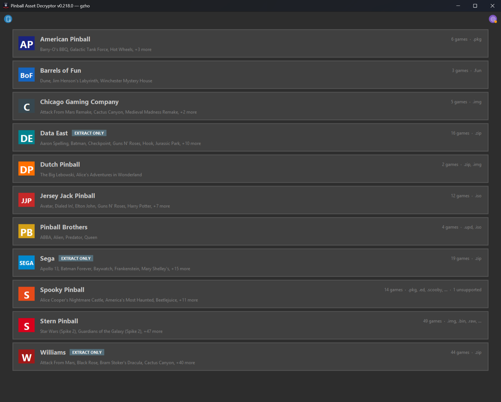
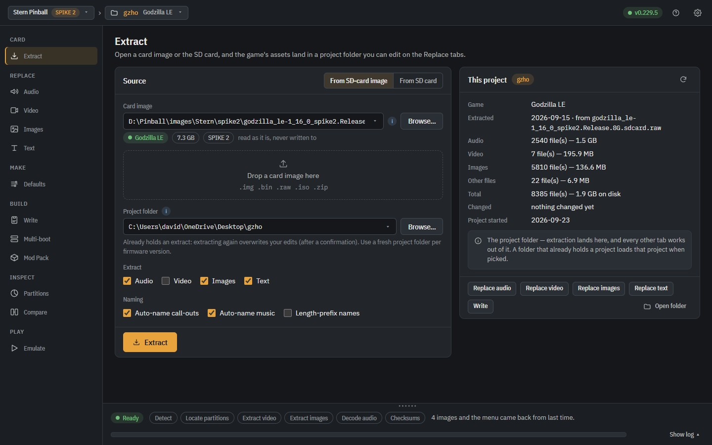
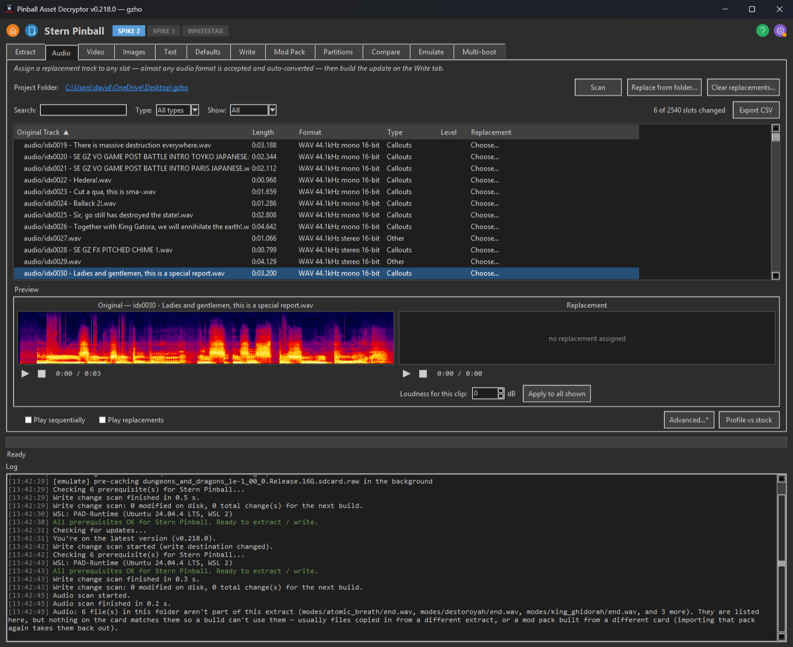
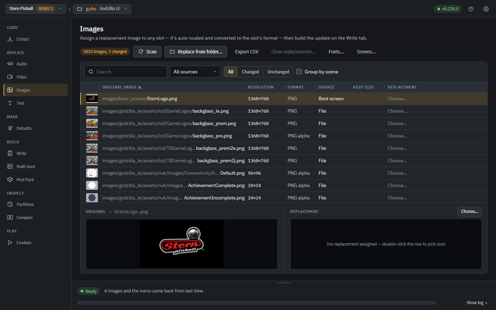
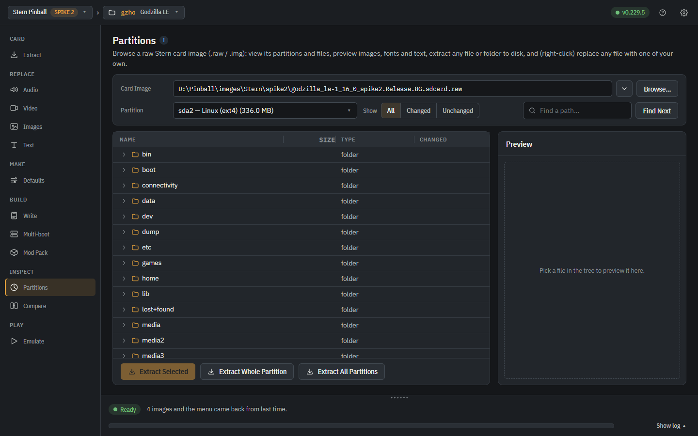

# Pinball Asset Decryptor

One app to extract, view, and modify game assets from pinball machines made
by **American Pinball**, **Barrels of Fun**, **Chicago Gaming Company**,
**Data East** (classic DMD), **Dutch Pinball**, **Jersey Jack Pinball**,
**Pinball Brothers**, **Sega** (Whitestar DMD), **Spooky Pinball**,
**Stern Pinball** (Spike 2 + Whitestar DMD), and **Williams** (WPC-era) —
130+ games across eleven manufacturers.

This is a unified replacement for separate decryptor apps that all shared
the same Tk GUI shell, queue-based pipeline contract, checksum tracking,
and mod-pack workflow. Each manufacturer is a plugin under
[pinball_decryptor/plugins/](pinball_decryptor/plugins/); the shared shell
lives in [pinball_decryptor/core/](pinball_decryptor/core/) and
[pinball_decryptor/gui/](pinball_decryptor/gui/).

## What it looks like

Pick a manufacturer on launch — each card lists every supported game:



Point the Extract tab at a card image (or the SD card itself) and pull
the assets out — here a Stern Jaws LE card:



Replace Audio lists every sound slot with side-by-side seekable
spectrograms to A/B the original against your replacement; Replace
Images searches the card's 12,000+ images with live previews:

<p>
  <a href="docs/screenshots/replace-audio.png"></a>
  <a href="docs/screenshots/replace-images.png"></a>
</p>

And the read-only Partition Explorer browses the raw card image's ext4
filesystem directly — no mounting, no WSL:



## Disclaimer

This project is an independent interoperability utility. It is **not
affiliated with, endorsed by, or sponsored by** American Pinball, Chicago
Gaming Company, Planetary Pinball Supply, Bally, Williams, Stern Pinball,
Jersey Jack Pinball, Pinball Brothers, Spooky Pinball, Barrels of Fun,
Dutch Pinball, or any other
pinball manufacturer, publisher, or rights holder. All trademarks and
game titles referenced are the property of their respective owners and
are used here in their nominative/descriptive sense only — to identify
which file formats this tool can read.

The tool ships **no game content** of any kind — no ROMs, no audio
samples, no graphics, no executables from any pinball machine. It is
inert until the user supplies their own file that they obtained
legitimately (typically by purchasing the machine, downloading the
official update from the manufacturer's support portal, or imaging
their own physical media).

Intended use is **personal customization of a machine you own** — the
same kind of fair-use modification covered by Sega v. Accolade (1992)
for reverse engineering interoperability and by the general right to
modify property you've legally purchased. Distributing modified game
assets to others, hosting copyrighted ROMs, or reselling modified
firmware is not supported by this tool and is **your responsibility to
avoid** — those activities have separate legal considerations the tool
does not address.

### A note on the DMCA

Some formats this tool reads sit behind a technical protection measure,
so U.S. users should be aware of the DMCA's anti-circumvention rules
(17 U.S.C. §1201). Two design choices keep this project on the
defensible side of that line:

- **It ships no keys and no protected content.** Where a manufacturer
  key is involved, the tool either derives it or reads it from *your
  own* hardware/media at runtime — nothing secret is embedded in, or
  distributed by, this repository.
- **Its purpose is interoperability and repair of a device you own** —
  the use case the Copyright Office has repeatedly recognized in its
  triennial §1201 exemptions for software-enabled devices, and the
  spirit of Sega v. Accolade. This is a non-commercial hobbyist utility;
  it is not sold and derives no revenue from circumvention.

None of this is legal advice, and §1201 is broad — its criminal
provisions (§1204) turn on *willful* circumvention *for commercial
advantage or private financial gain*, which this project is built to
stay clear of. Redistributing decrypted game assets, keys, or ROMs is
where real exposure lives; the tool doesn't do that and you shouldn't
either. If you ever receive a takedown notice or cease-and-desist,
consult a lawyer rather than responding solo — organizations like the
EFF have taken §1201 cases involving exactly this kind of repair and
interoperability work.

### Manufacturer license terms (EULAs)

Separate from copyright and the DMCA, the software on some machines is
licensed to the owner under an end-user license agreement (EULA) — a
private contract. Manufacturer EULAs are often written far more broadly
than copyright law requires and may **prohibit reverse engineering,
modification, creating derivative works, circumventing security
measures, and using or distributing "unauthorized" content or
software** — which can cover both modding a machine and building or
sharing a tool that helps others do so. A contract you agreed to can
restrict things that copyright law alone would permit, and the fair-use
/ interoperability framing above does **not** override it.

Stern Pinball's EULA is a notable example: it expressly bars owners
from reverse engineering the software, defeating its security measures,
and creating or **assisting anyone else** in creating unauthorized
content or software for a Stern machine. Using this tool on a Stern
machine you own would be inconsistent with those terms, and Stern warns
that unauthorized content or circumvention **may cause the machine to
stop working permanently or lose access to its online network**, either
immediately or after a later official update.

This project does not claim to be compatible with any manufacturer's
EULA. Whether a EULA applies to you, and whether its broadest clauses
are enforceable where you live, are legal questions that vary by
jurisdiction — decide for yourself, on a machine you own, and accept
that modding it may violate the license and disable the machine or its
online features. Breach of a EULA is a civil matter between you and the
manufacturer; it is a different (and generally lower) category of risk
than the criminal provisions discussed above, but it is real.

No warranty. Use entirely at your own risk. **Always make a complete,
working backup before modifying a machine** — a failed, interrupted, or
incorrect update can leave it unbootable ("bricked"), and without a
known-good backup image you may be unable to recover it. Flashing a
modified `.img` or installing a modified update can render a machine
inoperable until you restore a known-good image. The maintainers accept
no liability for bricked machines, damaged hardware, lost data, voided
warranties, or any other consequence of using this tool.

The app shows a short version of this disclaimer in a modal dialog the
first time you launch it, including a request to **not contact the
manufacturer's support team** about issues that may have been caused by
modified code — revert to stock firmware before opening a ticket, and
disclose any past modifications. The acceptance is stored in
`settings.json` and survives app updates; you're only asked to accept
once, and the full text stays re-readable any time via the ⚙ settings
menu → **View disclaimer…**.

## Supported manufacturers

| Manufacturer | Games | Input formats | Capabilities |
|---|---|---|---|
| **American Pinball** | 6 (Houdini, Oktoberfest, Hot Wheels, Legends of Valhalla, Galactic Tank Force, Barry-O's BBQ) | `.pkg` (AES-256-CBC encrypted ZIP) | Extract, Write, Replace Audio, Replace Video — the P-ROC / pyprocgame game tree ships as an AES-256-CBC ZIP behind an `[8B size][16B IV]` header (the `pkgprocess` container, shared lineage with Spooky). A single **static key** — recovered from `PACKAGE_SIGNING_KEY` in `/usr/bin/pkgprocess` on the Houdini / Oktoberfest / Hot Wheels Clonezilla images — decrypts every title across 2020-2024, so Write re-zips the modified tree and re-encrypts with the same key. Clonezilla `.iso` extraction (partclone ext4) is planned. See [docs/AP_PKG_RE.md](docs/AP_PKG_RE.md). |
| **Barrels of Fun** | 3 (Labyrinth, Dune, Winchester) | `.fun` | Extract, Write, Mod Pack, Replace Audio, Replace Video — see the [Barrels of Fun plugin](#barrels-of-fun-plugin) section for the full workflow. Native extractor for the **custom May 2026+ Godot PCK** variant (RSCC Zstd container + GBOF anti-tooling magic, no GDRE Tools needed; pre-May firmware still uses bundled GDRE).  Imported binaries are auto-decoded into editable formats under `pck/_EDITABLE ASSETS/` — `audio/` (`.wav`), `images/` (`.webp`), `video/` (`.ogv`), `fonts/` (`.ttf`/`.otf`) — so you can preview / play / edit them in standard tools and the Write pipeline re-encodes your edits back into the Godot-format binaries automatically (`.wav` → `.sample`, `.webp`/`.png` → `.ctex`; editable `.ogg` and font edits don't round-trip yet and are reported as skipped rather than shipped).  Video is separate: BOF stores its ~300 mode clips as plain Ogg Theora entries at `pck/assets/videos/`, and the Replace Video tab edits those in place.  Extraction is driven by the PCK's **own file directory** (AES-decrypted first on Dune) rather than by guessing file boundaries from the layout, so every one of the 5,296 entries lands byte-exact and is verified against the MD5 the directory records — which is also what lets a replacement of *any* size repack correctly, since the directory's absolute offsets are rewritten to match.  The Replace Audio tab carries a per-track **Loop** toggle (defaulted on for `*LOOP*`-named mode-music tracks) that bakes a forward-loop flag into the rebuilt audio so a replacement loops to fill its mode in-game instead of going silent partway through.  The Write tab shows a **Modified Files Preview** tree (MD5-based, catches rename swaps that mtime would miss — and lists any staged Replace Audio / Video swaps as *Pending*) so you can see exactly what's about to ship before clicking *Build update*.  Write also stamps the package with an **update version date** one day past the installed code (shown in an editable *Update version* field — leave it on *Auto*, or override it to force-install, e.g. to put official code back over a higher-dated mod) so the machine accepts the update instead of logging "no new code". |
| **Chicago Gaming Company** | 5 (Medieval Madness Remake, AFM Remake, MB Remake, Pulp Fiction, Cactus Canyon) | `.img` (raw bootable installer disk image; Cactus Canyon ships on a physical microSD master — image the whole card to `.img`) | Extract, Write, Mod Pack, Replace Audio. WPC remakes: 1300+ DCS `.wav` samples + ROM. Pulp Fiction: 6 JPS sound banks auto-decoded into ~1,000 `.wav` files and repacked on Write. **Cactus Canyon** (CGC `pin`-engine remake of the 1998 Bally game) decodes and **repacks** three surfaces: the original Williams DCS audio (`s2-s7.rom` ↔ addressable streams via the bundled DCSExplorer/DCSEncoder), CGC's added audio (the encrypted `usb.so` bank ↔ WAVs), and the colour LCD art (the obfuscated `cgc.so` archive ↔ 2044 RGB565 PNGs, including RLE-compressed sprites) — plus an optional pass that renders the art animation sequences to MP4 with a colour dot-matrix shader. Optional **Generate callouts.csv** (Whisper) and **Decode DMD scenes** (WPC remakes) round it out. See [docs/CC_REVISITED_RE.md](docs/CC_REVISITED_RE.md). |
| **Data East** (classic DMD) | 16 (Lethal Weapon 3, Jurassic Park, Tales from the Crypt, Star Trek 25th Anniversary, Hook, Teenage Mutant Ninja Turtles, Batman, The Who's Tommy, Guns N' Roses, WWF Royal Rumble, etc.) | `.zip` (MAME ROM dumps) | **Capture** (libpinmame) — these games store their DMD animations *compressed* in the DMD ROM, decodable only by the game's own firmware, so extraction runs the game in attract mode under PinMAME and records the decoded **4-shade DMD animations + synced audio** as per-scene MP4s (the method the DMD-colorization community uses). No static-decode path — raw ROM bytes hit the compressed regions and decode to noise (see [docs/DE_DMD_RE.md](docs/DE_DMD_RE.md)). User-supplied ROMs; none are bundled or redistributed. Requires libpinmame + ffmpeg. |
| **Dutch Pinball** | 2 (The Big Lebowski, Alice's Adventures in Wonderland) | TBL: `.zip` (full + delta updates); AAIW: `.img` (Clonezilla auto-installer) | Extract, Write, Apply Delta, Mod Pack, Replace Audio, Replace Video — **unencrypted**. **The Big Lebowski**: plain-zip extraction; the LCD's full-colour video ships as a custom `.cdmd` format the plugin decodes to MP4/PNG (audio auto-synced from the paired `.wav`), with an optional dot-matrix (DMD) display-effect shader. Supply a full image plus the delta(s) you need and Extract **auto-merges** them in version order (remapping onto the base version, validated against each delta's compatible-base list); Write rebuilds an installable update labelled one version newer than the merged version — with a fresh `delta` marker — so the machine's USB update accepts it. **Alice's Adventures in Wonderland**: reconstructs the game SSD from the Clonezilla partclone-v2 + zstd image with a pure-Python reader — fast local 7-Zip path (no WSL needed; WSL fallback). Assets are standard `.mp4` / `.mov` / `.wav` / `.png`; an optional toggle converts the game's ProRes `.mov` videos to playable H.264 MP4. |
| **Jersey Jack Pinball** | 12 (Wonka, GnR, Hobbit, Wizard of Oz, Avatar, Sonic the Hedgehog, etc.) | `.iso` Clonezilla image, or **directly from the game SSD** | Extract, Write, Mod Pack, Replace Audio, Replace Video, **Direct-SSD** (read/write the game's physical SSD without an ISO intermediate — auto-discovers the right partition, content-verifies `/jjpe/gen1`, mirrors writes across A/B slots so the change survives the next firmware boot).  A **Build / make USB install stick** button turns a built ISO into a ready-to-use install stick — the stick is formatted FAT32/MBR and the ISO's files are copied onto it, which is the only stick layout a JJP machine can read (the machine boots the Clonezilla live system off the stick's FAT volume and runs JJP's own installer from it, so a raw balenaEtcher/dd-imaged stick fails with *Failed to mount USB stick*).  Tick both halves of its dialog to build the ISO and make the stick in one step; the finished stick goes in a front-cabinet USB slot and the installer starts by itself at power-on — leave the purple security key plugged in, because the installer checks for it before anything else and stops on *Security key not found* without it.  Extract tab exposes per-category **Graphics / Sounds / File System** filters so you can skip categories you don't care about (and the slow full-filesystem dump is opt-in).  The Replace Audio tab carries a per-track **Full length** toggle — JJP trims every replacement to its original slot length by default, but ticking Full keeps a longer clip (best for a cue nothing plays over, e.g. the end-of-game track before attract); the file validates and boots at any length since `fl.dat` has no size field and CRCs are re-forged.  Decryption runs in parallel across all CPU cores (and checksums are computed during decrypt), so a full extract finishes several times faster.  Sonic-era images — JJP's rebuilt engine, which re-keyed the asset cipher, scrambled the first 128 bytes of every file and padded both ends of it — **extract and write back with no dongle at all**; the app recognises the scheme from the bytes on the image, so every older title takes exactly the path it always did. Replacements on these titles have to keep their original byte size: the game reads each asset's padding out of `fl.dat`, which this generation encrypts with the dongle, so the padding can't be rewritten — a size change is refused with an explanation rather than written as a file the game can't load. Everything else is handled for you, including re-forging the checksum the game verifies on load. An advanced **"Decrypt using the game's HASP dongle"** checkbox remains the escape hatch for a brand-new title whose asset encryption isn't reverse-engineered yet: with the game's matching Sentinel/HASP dongle plugged in, it runs the game under a shim that drives the game's *own* decryption, so the assets come out regardless of how the cipher changed (Windows/WSL only — each title needs its own dongle).  When used, it also drops a small `crypto_capture` file in the output that a developer can use to add dongle-free support for everyone.  The shim no longer depends on the game exporting its crypto under the exact names older titles used: it resolves them across everything the game has loaded, so a rebuilt engine that merely renamed them still decrypts.  A title that exports no crypto at all (JJP's newest protection generation, where the routines stay internal to the licensing envelope) can't be driven that way — so rather than fail with a misleading "check your dongle", the run says the dongle *did* work and saves a `jjp_diagnostics` archive to the output folder: the symbol census, the module map and the game's own decrypted code pulled out of the live process, which is what a developer needs to add that title.  Sending that file is the whole ask; a dongle session is hard to arrange and it no longer ends empty-handed — that archive is exactly how Sonic's dongle-free support was worked out, from a single run on one owner's machine. |
| **Pinball Brothers** | 4 (ABBA, Alien, Queen, Predator) | `.upd`, `.iso` (Clonezilla) | Extract, Write, Apply Delta, Mod Pack, Replace Audio, Replace Video |
| **Sega** (Whitestar DMD) | 18 (Apollo 13, GoldenEye, Twister, Independence Day, Space Jam, The Lost World, The X-Files, Starship Troopers, Godzilla, South Park, Star Wars Trilogy, plus the Sega-on-Data-East-hardware titles Maverick, Frankenstein, Baywatch, Batman Forever) | `.zip` (MAME ROM dumps) | **Capture** (libpinmame) — same as Data East. Sega's classic DMD games (1994–99, the Whitestar platform) store their animations compressed in the ROM, so extraction runs the game in attract mode under PinMAME and records the decoded DMD animations + synced audio as per-scene MP4s. User-supplied ROMs; none bundled or redistributed. Requires libpinmame + ffmpeg. |
| **Spooky Pinball** | 14 (Beetlejuice, Evil Dead, R&M, Halloween, Looney Tunes, etc.) | `.pkg`, `.ed`, `.scooby`, `.beetlejuice`, `.looney`, `.iso`, `.zip` | Extract, Write, Mod Pack, Replace Audio, Replace Video (Godot `.ogv`) |
| **Stern Pinball** (Spike 2) | 26 (Godzilla, Jurassic Park, Deadpool, Star Wars, Iron Maiden, Led Zeppelin, James Bond, etc.) | raw SD-card `.img` / `.bin` / `.raw`, or **directly from the SD card** | Extract, Write, Mod Pack, Replace Audio, Replace Video, Replace Images, **Replace Text**, **Direct-SD**, **Partition Explorer**, **Default Settings**, **Compare**, Auto-name call-outs (Whisper) + Auto-name music (AcoustID). Spike 2 cards are **unencrypted ext4**: video (H.264 `.asset`) and UI images (`.png`) are loose files that extract and patch in place. **In-scene art** also extracts and re-packs now — both the BC3/DXT5 *and* BC1/DXT1 textures Stern bakes into the scene graph: the font/sprite atlases and full-screen LCD background art in `scene.assets`, plus the rendered text banners (song titles like "ROCK AND ROLL", score lines, etc.) embedded directly inside the `.radium` scenes. Each decodes to an editable RGBA PNG (named by its scene-element id + dimensions) and re-encodes back size-neutral; identical glyphs are deduped and an edit is patched into **every** scene that draws it. **Font atlases go a step further: Extract slices every character into its own PNG** (`images/scene_textures/glyphs/<atlas>/U+0041_A.png`, rectangles read from the scene's font glyph tables) so you edit single letters instead of hand-measuring a 512×512 atlas in an image editor; on Write each edited glyph is pasted back into its exact rectangle and **only the touched 4×4 texture blocks are re-encoded**, leaving every character you didn't edit bit-identical to stock. A **Fonts window** (the *Fonts…* button on the Replace Images toolbar) goes further still: pick any game font and type your own preview text to see it rendered live from the real glyphs, laid out with the game's own metrics (bearings, baselines, advances — read from the scene files' font tables, including glyphs the packer stored rotated), with pending edits showing immediately — and **import a normal desktop font (TTF/OTF) into a game font**: the app picks one auto-fitted size so every letter fits the space its character has in the atlas, baseline-aligns each letter into its slot, starts the ink color matched to the original (with optional outline), and applies the result as ordinary glyph edits — with a one-click **Revert font** that restores every character from the atlas. Since one typeface is baked at many sizes and each is its own font on the card (TMNT carries 94 entries of a single title face), an import can **fit the same font file into every size of that typeface** in one go instead of ninety-odd repeats by hand. Stern draws its titles TWICE — a black outline instance underneath, from a *separate* outline font — so restyling only the visible letters leaves the old typeface's border around your new ones; the window now names that outline companion and offers to **remove it** with the import, limited to the scenes your font is actually in so the same outline stays put everywhere else. A **Letter width** control draws each letter narrower inside its slot, which is what opens a gap between letters that would otherwise touch (the game's own letter spacing is fixed on the card and an import can't change it); fonts too small to carry a typeface are flagged, an import you fitted but never applied is flagged too, and **Undo** plus **Revert all fonts** step back a whole restyle without re-extracting the card. A companion **Scenes window** lists every scene on the card with the images (in play order), fonts and on-screen text it is built from, and double-click jumps to the matching row on the Images tab, in the Fonts window, or on Replace Text — and the Scenes window steps behind the main one as it does, so you can see where you landed instead of the jump happening on a tab hidden underneath. The same route runs the other way: **Show in Scenes…** on Replace Text opens the scene that draws the selected line with the line picked out, right-clicking a video slot opens the scene that plays the clip, and right-clicking a scene in the Fonts window's usage list goes and looks at it (right-click, because clicking that list is how you choose which scenes an import lands in). It also **shows you the scene**: the radium node graph is decoded to a layout — which image each instance draws, where it sits, what its text says, which font and colour, and which nodes are children of which — and composited into a preview from **your own project folder**, so a replaced image or an imported font appears in it. Text comes out at the size the scene draws it and in the font that scene's own line names, which matters more than it sounds: an atlas is master art that each table scales to its own size, Stern bakes one typeface at eight sizes over a single atlas, and most scenes hold several typefaces at once — so a preview that assumed one font at one size per scene rendered whole titles several times too big, with lines overlapping each other and running off the stage. One scene file also holds every screen a mode can put up — its intro, each award, the phase and victory screens — and the machine shows one at a time as the game runs, so a **Screen** picker draws them one at a time under the game's own names (with ◀ ▶ to step through) instead of compositing them into a pile. Scenes that animate play their frames at the frame rate written in the scene itself (it is authored per scene — 12, 24, 30 and 60 all turn up on one card), with a **Speed** control to slow a fast sequence down for a closer look; the scene list sorts on any column, a preview saves out as a PNG (or an animated GIF), and **Rebuild previews** re-reads the layouts off the card in a few seconds without re-extracting — which matters because a full re-extract would overwrite every atlas and glyph slice, and take your font work with it. A preview can be laid over a different **backdrop** — white, greys, a checkerboard — instead of the machine's black, which is the only way to look at a black outline or find the edge of a piece of art (the saved PNG/GIF matches what you see; black stays the default because black is what the machine draws on). Right-click anything in a scene to act on it: **blank a font** out of the picture — how an outline or shadow font is removed, scoped to that one scene so the shared atlas keeps its border on the hundreds of screens you never opened — or **recolour a line of text**. Colour is worth spelling out, because it is not a font property at all: the atlases are white ink precisely so the *scene* can multiply them by an RGBA it carries per line, which is why painting an atlas green comes out olive over a gold line and stays invisible over a black one. The Fonts window now says what the scenes tint each font with, has a **Blank font** button of its own, and its **Color** picker works with no font file imported at all — a colour you pick is a setting that follows you down the font list, previewed on whatever font you select, and **Apply** repaints that font's existing letters in it (across every size of the typeface if you want), undoable and revertable like any other glyph edit. A recolour of the *text* is written where the game actually keeps it — a size-neutral patch of the RGBA floats inside the `scene.radium`, alpha left alone so a line that fades in still fades, and applied only to the keyframes still carrying the colour you picked from, since Stern draws every title twice (a black outline under a coloured fill) and repainting both would silently delete the border. The **Spine** 2D skeletal-animation rigs Stern embeds in its scenes also export — each scene's original Spine 3.1 skeleton JSON plus an atlas/animation manifest and an `index.json` catalog, written verbatim under `spine/`. **Audio** is the hard part — every sound is packed into `image.bin` and encoded with a per-sample stream cipher whose keystream is produced by the game firmware, so there's **no static key**: the plugin boots the card's own `game_real` firmware in an ARM emulator (unicorn), uses it as an oracle to recover each sound's exact keystream, and inverts it analytically — decode **and** re-encode are bit-exact, mono + stereo, across all 32 codec "scale" variants, with nothing title-specific bundled (a new title works as soon as its card is recognised). Direct-SD reads/writes the physical card through a pure-Python ext4 reader + sector-aligned raw-device I/O. Replacements are **size-neutral** (audio trimmed/padded to the original length; images fit to the original byte size); an oversized **video** instead grows to full size on the card via the Linux filesystem driver (WSL2 on Windows; e2fsprogs' `debugfs` on macOS — `brew install e2fsprogs`), so a replaced attract clip keeps full quality instead of being crushed into its stock byte slot. That full-size copy puts your file on the card byte-for-byte, which is what you want right up until the file isn't something the machine can actually decode — a Matroska container, HEVC, a 10-bit clip, or a resolution the scene never sized a surface for gets far enough for the **sound to play over a black picture**, and nothing said so at build time. Write now checks each clip is a genuine drop-in for the one it replaces (same container, H.264, 8-bit 4:2:0, the slot's own resolution and frame rate) and converts the ones that aren't, saying which and why in the log — so the list's **Convert** column and what Write actually does can no longer disagree. Clips it does convert are encoded to the **stock clip's own H.264 profile and level** rather than to the encoder's default, since the video already on the card is the only proof of what that machine's decoder accepts. A census of 2,251 clips across five titles settles what that means: **every clip Stern ships is H.264, 8-bit 4:2:0** — so a ProRes or HEVC file plays its sound over a black picture no matter how good it looks on a PC — while the profile, the frame size and even whether the clip carries audio all vary *within* one title, and so are read per slot rather than assumed. Right-click any slot and pick **What this slot needs…** to see that slot's exact target — container, codec, profile and level, size, frame rate, audio — with a copyable ffmpeg command that pins only the parts that must match, for anyone who would rather encode their own clips than let the app do it. The **Convert** column tells the two failure modes apart before you build: `✗ needs .mov` for a pick Write would refuse outright, `✗ wrong format` for one it would copy on untouched but the machine can't decode. A slot whose *current* clip is already one of those — a ProRes that went on as-is before the check existed — carries a ⚠ in its Format cell, and selecting the row spells the problem out in a callout under the preview, which also says when an assigned replacement will fix it at the next build (the Format/Audio cells describe the clip in the slot until then). Audio is matched to the slot too — nearly every game clip is silent and the game supplies its own sound, so a replacement that keeps its source's soundtrack gets that soundtrack played over the top; converting now strips it for a silent slot, and a file copied in as-is that carries one is flagged. Preview panes say why a frame can't be shown instead of going black, and a poster still looks past a black frame before reporting that the clip really is black there. On Write, the card's `.sidx` validation manifest is **regenerated for every changed file** (the keyed HMAC-SHA1 + MD5 digests Stern checks) so a modded card passes the machine's on-boot SD validation instead of erroring out. Write also **neutralizes the game firmware's own self/asset validator**: Stern's `game` binary runs an inlined checksum over its own bytes *and* every protected asset and flags the machine on any change, so a modded card would otherwise raise a **GAME VALIDATION ERROR / UPDATE SD CARD** message plus technician tamper alerts — the Write patches that routine out (it works on any Stern title and edition, and it's noted in the Write log when applied). The routine is found two independent ways — by the inlined CRC32 constants Stern's compiler leaves in it, and, for a build that stopped inlining those, by the routine's measured shape — and the two agree on every card in the 37-card reference library that carries it. **A validator that's there but can't be reached is now a loud failure rather than a silent no-op**: the build log says so at error level and the Write Complete dialog warns that the machine will likely answer with GAME VALIDATION ERROR, so an unrecognised firmware can no longer quietly produce a card that fails on hardware. Absence is only ever reported from positive evidence — two markers that track the routine itself, either of which alone reports it present — which is what separates a title that genuinely ships without the validator (Jaws LE, in both 1.01.0 and 1.02.0, and the only such title of the 37 cards checked) from one the app merely failed to recognise. Re-encoding also preserves the firmware's **master-directory decode chain** — its audio loader folds a slice of each sound's body bytes into the codec parameters of every *later* sound, so a naive re-encode desyncs the chain and the machine locks up on the first sound. Those consumed bytes are reverted to stock, which leaves a ~6 ms scrap of the *original* sound audible at two points inside every replacement (the "blip"). A firmware patch removes it: the Write rebuilds the `game_real` firmware so its boot-time setup reads those bytes from a stashed stock copy, and your replacement then plays cleanly for its whole length. Where that patch *lives* is the whole story. Until v0.94.0 it was placed in the first run of zero bytes in the firmware's data segment carrying no relocation, on the reasoning that such a run must be spare. It isn't — a zero-initialised global has no relocations either, so live storage and dead padding look identical to that rule, and on Elvira's House of Horrors the run it picked was the **node bus board table**: cards built that way boot very slowly, report node board errors and won't start a game. Section headers account for every byte of the data segment on all 17 firmwares checked, so there was never any genuinely unclaimed space to find. The patch now stops looking for space and **makes** it: the cave is appended to `game_real` and mapped by a program header of its own, at an address no segment claims, so nothing can own those bytes because they didn't exist until we wrote them. The cost is that `game_real` is no longer size-neutral, so a blip-free build needs the Linux filesystem driver (same requirement as full-size video replacement) and refreshes the firmware's `.sidx` size as well as its digests. It is on by default, with a **Blip-free callouts** checkbox in *Advanced Audio Options* (and a technical description of exactly what gets patched) to turn it off for a build that leaves the firmware alone apart from the long-standing 4-byte validator bypass below. A Write self-check re-derives all 2000-plus sounds' parameters and aborts if any would drift, and any firmware or host it can't safely patch falls back to the stock-byte restore automatically — and the **Write Complete dialog says which build the card actually got**: blip-free, or standard with the reason why (a fallback used to be visible only as a mid-build log warning, so a Windows host without WSL2 produced scrap-remains cards that looked blip-free), so a card is never tested on hardware under the wrong assumption. And a blip-free build now actually ships the firmware it rebuilt: on hosts that *have* the Linux filesystem driver, the rebuilt `game_real` was being deleted along with the build's scratch space before the driver copied it onto the card, so the card went out with its validation record already rewritten for a firmware that was never written — and, because the blip-free path leaves the validator bypass to ride inside that rebuilt firmware, with no bypass either. The machine answered with GAME VALIDATION ERROR / UPDATE SD CARD. The rebuilt firmware now gets its own scratch directory that outlives the patch computation and is released only once the copy has happened (on every exit path, cancel included), and a prepared file that has gone missing when it's time to copy it is named and raised as an error instead of being dropped without a word. This affected every blip-free build from v0.94.0 through v0.102.2 on hosts with the driver; hosts without it fell back to the standard build and were never affected. Fixing that delivery made v0.102.3 the first release to actually put the rebuilt firmware in front of a machine, and doing so surfaced two faults in the cave's own runtime behaviour, both fixed in v0.102.5 after a field report of a machine rebooting partway through its startup screen: the cave worked out where the audio image sat in memory from the first 512-byte read it saw (on a real machine an unrelated read can arrive first, leaving it redirecting nothing at all), and it acted only on reads of exactly 512 bytes while the firmware computes each window run's length as it goes (so a shorter run passed through un-redirected) — either way the boot-time derive reads the re-encoded bytes the cave exists to hide from it, and that is what makes a machine reboot. The calibrating read is now identified by the card's own contents rather than by call order, redirecting is decided by the file offset alone, and both fixes are pinned by instruction-level tests that drive the emitted patch through the exact sequences that broke it, plus an end-to-end re-derive against a real card where all 2,351 sounds keep valid parameters. What remains true is that a card built with the fixed cave has not yet been confirmed booting on real hardware — the checkbox stays the way out if a machine ever objects, at the cost of only the brief scrap. Separately, a Write whose derive caches have gone cold (they live in the system temp folder, keyed to the card, so a temp clean or an app update clears them) no longer sits silent for the minutes a full re-derive takes: it says why in the log and drives the progress bar, so a cold-cache Write looks slow instead of frozen — it costs time, not correctness, and needs no matching of app versions. **Replace Text** pulls the on-screen LCD display strings out of the `.radium` scene files into an editable `text/strings.tsv` you edit in place, then patches each matching string back size-neutral on Write (a replacement is space-padded to its original byte length; one that's longer is rejected). The Extract tab exposes per-type **Audio / Video / Images / Text** checkboxes (default all on) so you can skip the slow audio decode — or the hundreds of in-scene textures — when you only want one category. **Sounds are named by the game itself.** Most titles carry a Sound Test menu listing their sounds, and Extract follows the firmware's own chain from a menu entry to the sound it plays — menu name to node id, node id to the sound-id list it indexes, sound id through the asset resolver to the container key, and that key to the extracted slot — so a decoded sound arrives as `idx0091 - SE FX MATCH.wav` instead of a bare number. What the menu names varies a lot by title: Led Zeppelin lists 244 sound effects, Godzilla 1314 and Jaws 1352, while TMNT names just ten and Elvira's House of Horrors names 8 voice lines and **53 music tracks** outright. The naming convention varies too (`SE FX ...`, `SPEECH: ...`, `VO: ...`, `MUSIC: ...`, or no prefix at all), so the menu is located by its **structure** — it is the one table in the binary that a node-id array points at — rather than by any string, and that array does not have to sit next to it. Several links in the chain are silently shiftable, and getting one wrong still produces real names on real files, just the wrong ones, which is exactly what shipped and had to be pulled twice. So the finished map is **checked against the audio before it is used**: Stern names a lit target's sound and its unlit twin, names each bank or series of targets together, and where it names music that music has to be the long recordings — so on a correct map the lit variant is the longer recording (20 of 21 pairs on Led Zeppelin) and the members of a series share one duration to three decimal places. Those collapse under any shift, and a map that doesn't clear them against a reshuffled null is discarded and the sounds keep their `idx` numbers. Spoken callouts are in some titles' menus and not others; anything the menu doesn't name stays with the Whisper transcriber, which skips already-named files so nothing gets labelled twice. The menu listing is also written to `sound_test_names.csv` so you can play a number on the machine and check what the extract called it. The Replace Audio tab picks the naming up with a **Type** filter (Music / Sound FX / Callouts / Other) and right-click **Properties…** (name + type) — a rename is remembered by the sound's content hash and reapplied on every future extract before Whisper runs, so a mis-heard callout stays fixed across re-extracts and firmware updates. An optional **Length-prefix names** checkbox names each extracted sound by its play length (`01m22s235 - idx0001.wav`) so a plain name sort lines the same sounds up across firmware versions, where the slot numbers shift but the play lengths rarely do. The Replace Images tab's **Source** column tells the image stores apart (loose files / scene textures / radium-embedded / font glyph slices), a **Source dropdown** filters the list to one store, and **Group by scene** nests every image under its scene/animation container in play order — with a sortable per-group image-count column, right-click bulk assign/blank/clear, and **renameable groups** (most factory scene names are generic; your names persist per extract, are restored automatically when you re-extract the same card, ride a Mod Pack transfer to a new version, and match in Search). A **Default Settings** tab presets the operator-adjustment defaults baked into a card image — free play, volume, **music and speech attenuation**, language, replay percentage, backbox / cabinet / GI / LED / flasher brightness, the **Insider Connected** behaviour the card can actually set (message of the day, Home Team, the login and play-again timers), the **factory high-score and champion thresholds**, and more, grouped under headings and shown next to the value currently on the card — every edit **stages itself automatically** like any other mod and is baked into the card you Build (validation record refreshed automatically) so your master image stays untouched; they apply on a fresh flash or factory reset (a machine that's already set up keeps its board-stored settings), and saveable presets can be auto-applied to every card you build. A **High Scores** block on the same tab edits the whole factory board a fresh card boots with — the **initials and player name** of every slot as well as its score, for the Grand Champion, the four high scores and each mode champion (Stern ships them filled with the design team's initials). The names are not adjustments: they are their own table of strings in the game binary, found generically by its shape rather than by any per-title constant, and patched inside each slot's existing space so the card stays byte-for-byte the same size — which is why every field is capped at the room its own slot has (initials are always three characters). The same tab also lists **every** adjustment the firmware carries, with the caption the machine itself prints — and says which of them the machine can actually reach. Some settings read fine off the card but never appear in any menu on a real machine (Mandalorian's `ALLOW TOPPER CHEATS` and `THIS IS THE WAY DEBUG`, for instance), and nothing in the setting itself marks them: a hidden one and a visible one are byte-for-byte alike. Visibility is decided by the **menu**, which enumerates the adjustments it draws — so the app reads those pages out of the game binary and flags each setting as one the Adjustments menu shows, one the machine edits on another service screen (volume, speakers, software update, tournament, redemption), or a **Debug** one no menu shows at all: factory tuning values, mech timings and developer leftovers. A one-click filter leaves just the ones the Adjustments menu can't reach, and a build whose menu can't be read says so rather than guessing. **Double-click any of them to set the default it ships with**, hidden ones included — a setting the machine never shows still uses its compiled default, so switching one on from here is how it gets switched on at all. And since being hidden is a property of the *menu*, the menu can be changed: **Show hidden settings in the machine's menu…** extends the Feature Adjustments page so the machine itself lists and edits them, which is one rewritten instruction in the game binary (so the card stays exactly the same size and its validation record refreshes as usual). You choose how far it opens — the page is a straight run, so everything up to your pick comes with it — and titles whose menu the app couldn't fully read are refused rather than guessed at. What that exposes is per title and often worth having: Venom's `REPLACE LICENSED TUNE`, Deadpool's `FREQ 4TH WALL` and `PHOTO SHOOT`, Iron Maiden's `MADNESS MODE` block, Mandalorian's topper cheats. The menu patch has been verified against 13 of 14 title firmwares (the pages read back correctly out of the patched binary) but **not yet on a real machine**, and the settings it reaches include factory test and bookkeeping entries the game never expected an operator to change — so it says so before you use it. An **ⓘ Image Info** button beside the image pickers reports everything the app can read from a card without extracting it — game, firmware version, edition, partition layout, on-card asset counts, and how many **operator adjustments** and **high-score places** the firmware defines (read straight out of the game binary; what an operator has actually *set*, and the scores actually played, live in the machine's own memory rather than on the card) — with a Copy Report button for bug reports. A **Compare** tab takes two card images — two firmware releases, or a modded card against its stock base — and reports what changed without extracting either: file-level added / modified / deleted comes from the cards' own validation manifests (so diffing two multi-GB images takes seconds, not an extract each), changed files are bucketed into videos, images, scenes, per-song music banks and other files, sound counts plus an image.bin changed/unchanged row cover the audio container, and the operator-adjustment defaults and factory high-score board are decoded from both game binaries and diffed entry by entry — with its own Copy Report button for sharing the result. Individual sounds packed inside image.bin can't be diffed one by one without an extract, and the report says so rather than guessing. A read-only **Partition Explorer** tab browses the card image's partitions and ext4 filesystem directly, so you can preview or extract any file or folder — a radium scene to carry into another version, a boot script, or a whole partition to diff against stock — without mounting the card. Every Replace tab links into it: right-click any sound, clip or image and **Find in Partition Explorer** opens the card image and expands the tree down to the file that asset came from — for an image that means the exact `.radium` container it lives inside, and for a sound (which isn't a standalone file on the card) the bank it's decoded out of. The Replace tabs also carry a **Changed only** filter and **Export CSV** on audio, video and images alike, so a large replacement project can be reviewed without scrolling past untouched slots or tracked in a spreadsheet. Replace Video adds a **Convert** column saying, per slot, whether your replacement goes on the card *as-is* or gets re-encoded first — worked out in the background from the file you assigned, so a job that will spend minutes in ffmpeg is visible before you start the build rather than after. A header **era switcher** picks the hardware generation: Spike 2 (the full modding flow above) or the classic **Whitestar** DMD games (1999–2006 — Monopoly, Elvis, LOTR, Sopranos, etc.), which capture-extract under PinMAME exactly like the Sega / Data East entries (user-supplied ROMs; none bundled). See [docs/architecture/stern.md](docs/architecture/stern.md). |
| **Williams** (WPC-era) | 41 WPC titles (Attack From Mars, Medieval Madness, Twilight Zone, Theatre of Magic, Fish Tales, etc.) | `.zip` (MAME ROM dumps) | **Static**: DMD scene PNGs, animation MP4s, font strips, and per-track DCS sound-ROM audio decoded from the ROM. **Capture**: per-scene gameplay MP4s with synced DCS audio via libpinmame (scripted playthrough — skill shots, mode starts, multiball, jackpots). Optional **Auto-transcribe** names the extracted audio by its spoken call-outs. |

The full per-game lists with the format-specific quirks live in the plugin
sources:
[ap/games.py](pinball_decryptor/plugins/ap/games.py),
[bof/games.py](pinball_decryptor/plugins/bof/games.py),
[cgc/games.py](pinball_decryptor/plugins/cgc/games.py),
[jjp/games.py](pinball_decryptor/plugins/jjp/games.py),
[pb/games.py](pinball_decryptor/plugins/pb/games.py),
[spooky/games.py](pinball_decryptor/plugins/spooky/games.py),
[stern/games.py](pinball_decryptor/plugins/stern/games.py),
[williams/games.py](pinball_decryptor/plugins/williams/games.py).

The Williams plugin has two complementary extract paths, independently
togglable via checkboxes on the Extract tab:

### Static extract (ROM-decoded assets)

Python port of
[permartinson/wpcedit.js](https://github.com/permartinson/wpcedit.js)
(based on Garrett Lee's original 2004 WPC Edit) to walk the WPC ROM's
font/graphics/animation master tables and decode the 11 compressed-frame
encodings the game's 6809 code uses at runtime. Output per game:

- **`dmd_scenes/scene_*.png`** — one PNG per full-frame DMD bitmap
  (jackpot splashes, mode-start announcements, title cards). Order
  of magnitude: ~800–1400 scenes per game ROM.
- **`dmd_scenes/pairs/pair_*.png`** — 4-shade composites that pair
  consecutive low+high planes.
- **`dmd_scenes/browse.mp4`** — every scene back-to-back at 2 fps so
  you can skim hundreds in a minute.
- **`animations/anim_*.mp4`** — true game animations decoded from
  the WPC animation table (one MP4 per cinematic sequence — the
  "fish growing toward you" attract animation in Fish Tales, the
  motorcycle ride in No Fear, etc.).
- **`fonts/font_*.png`** — sprite-sheet grids of every DMD glyph
  atlas (full ASCII alphabets in multiple sizes).
- **`sounds/track_*.wav`** — every music cue, voice line, and sound
  effect from the game's DCS sound ROMs, one WAV per track, plus a
  `manifest.json`. DCS-era games (1993+) only — pre-DCS titles like
  Fish Tales use the older YM2151 sound board and have no statically
  decodable audio. Decoded with a bundled
  [DCSExplorer](https://github.com/mjrgh/DCSExplorer) build (BSD-3).

Tick **Auto-transcribe samples to callouts.csv** on the Extract tab
(shown only for DCS-era games) to run `faster-whisper` over the
extracted tracks and emit a CSV — or renamed WAVs — mapping each
sound to its spoken call-out, the same mechanism the CGC plugin uses.

### PinMAME runtime capture (composed cinematics + audio)

Drives [libpinmame](https://github.com/vpinball/pinmame) under ctypes,
auto-credits + presses Start + plays a per-game scripted shot sequence
so the ROM walks through its named cinematics — skill shots, mode
starts, multiball, jackpots, end-of-ball bonus, etc.  Emits one MP4 per
scene named for the moment (e.g. `skill_shot.mp4`,
`multiball_start.mp4`, `total_annihilation_setup.mp4`) with synced DCS
audio.

16 popular titles have hand-tuned scripts of 10–21 named moments each:
AFM, MM, ToM, FT, WW, TZ, AF, STTNG, IJ, JD, NGG, T2, DM, RS, SS,
Dracula. The remaining 25 games use a smart-generic pattern matcher
that builds an equivalent playthrough from the per-game PinMAME switch
profile.

While the capture is running, the GUI shows a live DMD preview pane
and a labeled switch-matrix grid — click any switch to manually press
it for diagnostics.

## Chicago Gaming Company plugin (v0.5.0)

CGC's installer `.img` files are raw bootable disk images with three
nested layers — an MBR-partitioned installer rootfs containing an
`emmc.img` blob that's itself an MBR-partitioned ext4 disk holding the
actual game. **No encryption** anywhere in the chain; the difficulty
is purely the nesting. The plugin handles all three layers
transparently — you give it `.img`, you get back the playable game's
asset tree.

### Asset shape per game

- **MM / AFM / MB Remakes** (CGC's `emumm` WPC emulator + original
  Williams ROM): `appdata/samples/vol_25perc/S<NNNN>_C<N>.wav` — a few
  hundred pre-attenuated `.wav` callouts per game, in standard 16-bit
  stereo PCM. Plus the original WPC ROM in `rom/` and boot bitmaps.
- **Pulp Fiction** (CGC original on a BeagleBone Black, audio engine
  CGC's in-house "JPS" library): 6 `.bnk` sound banks the plugin
  auto-decodes into ~1,000 individual `.wav` files (music + speech +
  SFX + diagnostics + beeped-speech) plus a `manifest.json` mapping
  every event to its underlying buffer. Repacks on Write so audio
  swaps end up back in the `.img` byte-for-byte verified by software
  round-trip. The full reverse-engineering journal lives in
  [docs/CGC_BNK_RE.md](docs/CGC_BNK_RE.md).
- **Cactus Canyon** (CGC's `pin`-engine remake of the 1998 Bally game;
  ships only on a physical microSD master card — image the whole card
  to a `.img`): three editable surfaces, each round-trippable. The
  original Williams **DCS** sound ROMs (`rom/s2-s7.rom`) decode to
  addressable audio streams under `dcs_audio/` and repack via the
  bundled DCSExplorer/DCSEncoder. CGC's **added audio** lives in the
  encrypted `usb.so` bank — decrypted to 756 WAVs under `new_audio/`
  and re-encrypted on Write. The colour **display art** lives in the
  obfuscated `cgc.so` archive — 2044 RGB565 images under `display_art/`
  (both raw frames and RLE-compressed transparent sprites), re-encoded
  on Write (raw frames; RLE sprites are view-only). Tick **Decode DMD
  scenes** to also render the art animation sequences to `videos/*.mp4`
  through the colour dot-matrix shader. Full reverse-engineering journal:
  [docs/CC_REVISITED_RE.md](docs/CC_REVISITED_RE.md).

### Auto-transcribe samples to `callouts.csv` (opt-in)

CGC's audio filenames are sequential codes (`S0197_C6.wav`) with no
human-readable names. Tick **Auto-transcribe samples to callouts.csv**
on the Extract tab to run `faster-whisper` (tiny.en, CPU-int8) across
every extracted WAV, with silence/non-speech filtered out via the
built-in Silero VAD. Output is a CSV with one row per WAV — folder and
filename in their own sortable columns, the play length in seconds,
and the detected English text — so you can open Excel and search
"Joust champion!" to find which sample to swap.

Tick the companion **...and rename WAVs using transcripts** checkbox
to also rename each speech WAV in place — `S0197_C6.wav` becomes
`S0197_C6 - Get the troops ready.wav` so File Explorer shows the
content inline. Write is rename-aware: edits to renamed files get
written back to the original inner-ext4 path the game expects.

The `faster-whisper` pip package is treated as a real prerequisite and
auto-installed by **Install Prerequisites** (same flow as the WSL
tools). The model itself (~75 MB) downloads on first transcribe-run
and is cached in `%USERPROFILE%\.cache\huggingface\`.

### Group duplicate sounds (Pulp Fiction)

Pulp Fiction ships the same recording at several bank slots at once —
the censored `pfspeechBEEPD` bank mirrors `pfspeech`, and some lines
repeat again in the UI and SFX banks — so replacing just one copy can
leave the machine playing a stock twin, which looks exactly like a
build that didn't take. Tick **Group duplicates** on the Replace Audio
tab to cluster every slot that carries byte-identical audio under one
collapsible row (the first tick decodes and fingerprints all ~1,000
sounds, about ten seconds). To mod a duplicated sound everywhere it
plays, assign your replacement to one copy, then right-click it and
choose **Apply to all copies** — the edit fans out to the rest of the
group in one step.

### Decode DMD scenes to PNG/MP4 (experimental, opt-in)

CGC's MM / AFM / MB remakes bundle the original Williams WPC game ROM
and run it under their `emumm` emulator. Tick **Decode DMD scenes to
PNG/MP4 (experimental, extract-only)** on the Extract tab to also walk
that ROM's master tables and emit:

- `dmd/dmd_scenes/scene_*.png` — every still bitmap in the ROM
  (jackpot splashes, mode-start screens, status panels), rendered at
  1920×480 to match the LCD-backbox width.
- `dmd/animations/anim_*.mp4` — the cinematics from the ROM's
  animation table, one MP4 per sequence (attract-mode shorts,
  feature-shot reactions, etc.).
- `dmd/fonts/font_*.png` — DMD glyph sprite sheets.

The decode adds a few minutes to Extract. Output is **extract-only**:
the `dmd/` folder is excluded from the modding baseline and the Write
pipeline so the derived renders are never pushed back into the
installer. CGC's runtime LCD colorization is applied by the `emumm`
binary's GPU code and isn't shipped as data, so these renders come out
in the original amber-DMD look (the same look the Williams plugin
produces). Same `wpc_decode` / `dmd_render` modules under the hood, so
any decoder fix benefits both.

### Card diagnostics (Write tab)

If a rebuilt installer card fails on the machine — e.g. the classic
"SHELL ERROR" on the displays after the countdown — the **Card
diagnostics…** button on the Write tab reads the installer's own copy
log (`procstat.txt`) back off the card and checks the install payload
(`emmc.img`) is present and readable. It's read-only and needs no WSL or
mounting (the app reads the card's ext4 partitions directly), which
matters because Windows can't open those partitions and `wsl --mount`
refuses most USB SD readers. The report shows how far the on-machine
copy got and where it stopped, so a bad card, a truncated payload, or a
failed flash can be told apart. To back this up, the Write pipeline now
filesystem-checks the rebuilt game partition and verifies the re-packed
`emmc.img` byte-for-byte before it will hand you an image to flash, so a
silently-corrupt build is caught at build time instead of on the
machine.

The most important thing the diagnostics know about: CGC's factory
images ship their data partition with an unfinished ext4 journal, and
on any card built by a version older than v0.36.0 the machine's first
mount would silently replay that stale factory journal over the
build's modifications — reverting the payload and failing the install
with SHELL ERROR even though the card verified perfectly after
flashing. Builds made with v0.36.0+ retire the journal automatically;
the diagnostics flag any older modded card that still carries the armed
journal so you know to rebuild it rather than blame the card.

Flashing a card is otherwise a blind raw write with no integrity check,
so a single bad sector or a flaky reader can corrupt the card silently —
and a partially-written installer can SHELL ERROR or leave the machine
unbootable. The **Build / flash SD card** button now reads the whole
card back after writing and compares it byte-for-byte to the image,
aborting if anything doesn't match, so a bad flash is caught on your PC
instead of at the machine. (This roughly doubles the flash time; the
progress bar shows a separate "Verify card" phase.)

Flashing writes raw disk sectors, which needs administrator access — but
you no longer have to launch the whole app elevated for it. If the app
isn't already running as an administrator, the flash asks for approval at
the moment you start it and elevates just the write: a UAC prompt on
Windows, your login password on macOS (the way Etcher does it). On
Windows the Start Menu shortcut already elevates at launch, so you won't
see a second prompt there.

On macOS the first flash can additionally stop with a **Full Disk
Access** message: recent macOS versions block raw SD-card access — even
with your password — until the app is granted Full Disk Access under
System Settings → Privacy & Security. It's a one-time setup; the error
message in the app spells out the exact steps. Quit (⌘Q) and reopen the
app after granting it, then flash again.

## Barrels of Fun plugin

### Why this app is needed for recent firmware

Starting with the April 2026 firmware (Winchester 4/29, Dune 5/13), BOF
ships its games in a custom Godot PCK format that no public extractor —
including GDRE Tools — can read. Older `.fun` files use stock Godot and
work with GDRE; this newer format needs the Pinball Asset Decryptor.

### What Extract does

- Decrypts the `.fun` and pulls out the Godot binary
- Patches BOF's custom PCK magic markers back to stock Godot
- Reads the PCK's own file directory (decrypting it first on Dune) and
  writes every entry at its exact recorded offset and size, checking each
  one against the MD5 the directory carries
- Decompresses fonts from BOF's Zstd "RSCC" container
- Decodes QOA-compressed audio to standard WAV
- Unwraps textures (GST2 + WebP) to standard WEBP
- Lays the game's own `res://` tree out under `pck/`, and additionally
  writes player-friendly copies of the *imported* assets to
  `pck/_EDITABLE ASSETS/` (`audio/`, `images/`, `fonts/`)

### Editing

There are two places to edit, depending on the asset:

**Imported assets — audio, textures, fonts.** These are Godot binaries
(`.sample`, `.ctex`, `.fontdata`), so Extract decodes each into a normal
file under `pck/_EDITABLE ASSETS/`. Edit those: every audio file is
playable in VLC / Audacity, every texture opens in any image viewer.
Keep each file's name as extracted — the 6-character hash in
`title_card-7787d7.webp` is what pairs the edit back to its Godot binary,
and renaming it means Write can't find what it belongs to. Moving a file
between the `audio/` / `images/` / `fonts/` subfolders is fine.

**Standalone files — video, and anything else the game stores plainly.**
These sit at their real game path under `pck/` (video lives in
`pck/assets/videos/<mode>/`). Edit or replace them in place, keeping the
filename; Write picks them up by content hash.

Either way, use the Write tab afterwards to repack into a new `.fun`.

### Video slots

BOF ships its mode videos as plain Ogg Theora files in the PCK — Dune
carries 297 of them at 1280x720, about 1 GB, under
`pck/assets/videos/`. The **Replace Video** tab lists them like any other
game's clips: assign a replacement in any format and it's re-encoded to
Theora at the slot's own resolution and frame rate. Replacements do not
have to match the original's byte size — Write re-points the PCK's file
offsets so a longer clip still loads.

### What doesn't round-trip yet

Editing an extracted `.ogg` (from `.oggvorbisstr`) or `.ttf`/`.otf` (from
`.fontdata`) has no effect at Write — those inverse encoders aren't
written yet, and the build log says so rather than failing silently. The
compiled scripts and scenes (`.gdc` / `.scn` / `.res`) extract for
reference but aren't substituted back.

## Install

### Windows

Download the latest `Pinball_Asset_Decryptor_v*_Windows.exe` from the
[Releases page](https://github.com/davidvanderburgh/pinball-asset-decryptor/releases)
and run it. The installer bundles a Python runtime so nothing else is needed
to launch the GUI.

The installed shortcuts start the app **as Administrator** (one standard
UAC prompt per launch) — the SD-card and Direct-SSD write paths need
elevation, and forgetting the old right-click → *Run as administrator*
used to fail halfway through a run. Paths on mapped network drives
(`W:\…`) keep working in the elevated session: Windows hides mapped
letters from elevated processes, so the app translates them to their
`\\server\share` form automatically. Network paths work in the
WSL-backed pipelines too — the app mounts the share inside WSL on its
own when an extract or write needs it.

After install, run **Install Prerequisites** from the Start Menu — it asks
which manufacturers you'll actually use and installs only the tools those
plugins need (see [Per-manufacturer prerequisites](#per-manufacturer-prerequisites)
below).

If your machine didn't already have WSL2, that first run ends with a
**restart required** banner: WSL2 only finishes installing after Windows
restarts (use *Restart* — with Fast Startup enabled, *Shut down* doesn't
count). After the restart, run **Install Prerequisites** from the Start
Menu once more to pick up the remaining WSL-side packages — the script is
safe to re-run and skips anything already installed.

### macOS

1. Download the DMG matching your Mac from the
   [Releases page](https://github.com/davidvanderburgh/pinball-asset-decryptor/releases):
   - `Pinball_Asset_Decryptor_v*_macOS_AppleSilicon.dmg` for Apple
     Silicon Macs (M1 or newer).
   - `Pinball_Asset_Decryptor_v*_macOS_Intel.dmg` for Intel Macs
     (requires macOS 13 Ventura or newer).

   Not sure which you have?  **Apple menu → About This Mac** — the
   *Chip* line says "Apple M1/M2/…" on Apple Silicon; Intel Macs show a
   *Processor* line with "Intel" in it.  Opening the wrong one fails
   with *"…is not supported on this type of Mac"* (an architecture
   error, not the security prompt described below — releases before
   v0.39.0 shipped Apple Silicon only, which is why they refused to
   open on Intel iMacs).
2. Open the DMG and drag **Pinball Asset Decryptor** to your
   `/Applications` folder.
3. **First-launch security override** — required because the app is
   ad-hoc signed (no Apple Developer ID).  Try to open the app once;
   macOS will refuse with *"Apple could not verify Pinball Asset
   Decryptor is free of malware…"*.  Then:
   - Open **System Settings → Privacy & Security**.
   - Scroll down to the **Security** section.  You'll see a line that
     says *"Pinball Asset Decryptor was blocked to protect your Mac."*
   - Click **Open Anyway** next to it.  Confirm with your password /
     Touch ID.
   - macOS will pop one more dialog asking if you're sure — click
     **Open**.
4. The app now launches and remembers the override; subsequent launches
   open without prompting.

**If the app still bounces in the Dock and never appears** after the
override, the quarantine attribute didn't get cleared — strip it
manually in Terminal:

```bash
xattr -dr com.apple.quarantine "/Applications/Pinball Asset Decryptor.app"
```

Then double-click the app again.  (This is rare but happens on some
Sonoma / Sequoia setups where Gatekeeper's "Allow Anyway" click doesn't
fully drop the extended attribute.)

For **Spooky** and **JJP** Clonezilla extraction you'll also need
[Docker Desktop](https://www.docker.com/products/docker-desktop/) —
the app builds and uses an ephemeral container for partclone / debugfs
on those flows.  The other manufacturers (PB, BOF, CGC, Williams) run
without Docker.

### Linux

Download the latest `Pinball_Asset_Decryptor_v*_Linux_x86_64.AppImage`
from the [Releases page](https://github.com/davidvanderburgh/pinball-asset-decryptor/releases),
mark it executable, and run it:

```bash
chmod +x Pinball_Asset_Decryptor_v*_Linux_x86_64.AppImage
./Pinball_Asset_Decryptor_v*_Linux_x86_64.AppImage
```

After install, run **Install Missing** from the prereqs row (or run
[installer/install_prerequisites_linux.sh](installer/install_prerequisites_linux.sh)
directly) — it asks which manufacturers you'll actually use and installs
only the apt packages those plugins need (see
[Per-manufacturer prerequisites](#per-manufacturer-prerequisites) below).

The installer expects an apt-based distro (Debian / Ubuntu); on other
distros, install the equivalent packages manually using the table in that
section.

### From source

```bash
git clone https://github.com/davidvanderburgh/pinball-asset-decryptor.git
cd pinball-asset-decryptor
pip install -r requirements.txt
pip install pycryptodome UnityPy fsb5 pyogg   # only needed for Spooky
python -m pinball_decryptor
```

Or double-click [Pinball Asset Decryptor.pyw](Pinball Asset Decryptor.pyw)
on Windows / [launch.vbs](launch.vbs) for a no-console launch.

## Quick start

1. On launch, the **picker** shows a card per manufacturer with every
   compatible game listed (greyed + struck-through for ones not
   currently decryptable — e.g. Spooky's Total Nuclear Annihilation,
   AES key unknown). Click a card to enter that manufacturer's view.
2. The **prerequisites** row at the top of the mfr view turns each
   needed tool green (✓) or red (✗); hover for an install hint. Once
   everything is green the row tucks itself away — the **⚙ settings
   menu** (top-right) keeps the status plus the Re-check / Install
   actions, along with the light/dark theme switch, update check,
   disk-space manager and voice-recognition quality (including a
   one-click reset of the downloaded voice models).
3. **Extract tab** — pick an input file and an output folder; click
   *Extract*. The output folder gets the decrypted assets plus a
   `.checksums.md5` baseline used by the Write tab.
4. Modify any files in the output folder you want to change.
   *(BOF specifically:* edit the human-friendly files under
   `pck/_EDITABLE ASSETS/audio|images|video|fonts/` — drop in a new
   `.wav`, `.webp`, `.ogv`, or `.ttf` with the same filename and the
   Write pipeline re-encodes it back into the matching Godot binary
   for you.  You don't need to touch the raw `.sample` / `.ctex` /
   `.fontdata` files.)*
5. **Replace Audio tab** *(file-based plugins)* — swap a game's music /
   sound effects without copy-pasting and renaming. Scan the assets
   folder, pick a slot, and assign a replacement in almost any format
   (mp3, wav, ogg, flac, m4a, …) — it's auto-converted to the original
   track's codec / sample-rate for you. The original and your replacement
   sit in side-by-side seekable-spectrogram panes, each with its own
   play/stop transport, so you can A/B them (starting one pane pauses the
   other). Where the extract classifies (Stern auto-naming, callouts.csv),
   a **Type** dropdown filters the list to one kind of audio — Music,
   Sound FX, Callouts, or Other — so you can work through just the
   callouts without scrolling past everything else. Right-click →
   **Rename…** corrects a slot's name in place; the name is remembered
   by the sound's content fingerprint and reapplied automatically on
   every future extract, *before* the transcriber runs, so a callout
   Whisper keeps mis-hearing stays fixed once you've named it — and the
   slot keeps its Type bucket. On Stern titles carrying a Sound Test
   menu the sounds it names arrive **already named by the game itself**
   (`idx0091 - SE FX MATCH.wav`), and the Rename dialog offers the full
   menu listing as suggestions (from the `sound_test_names.csv` the
   extract writes): play a number on the machine's Sound Test menu and
   either confirm what the extract called that slot or pick the entry
   yourself. Tick **Play sequentially** and a clip that finishes
   selects and plays the next row on its own, following whatever sort,
   search and Type filter you have set, so you can listen through a
   whole card hands-free and stop on anything that needs attention.
   Add **Play replacements** and every row that has one plays
   the replacement instead of the original — the list sounds the way
   the built card will, so anything that still sounds stock is a clip
   you haven't replaced yet.
6. **Replace Video tab** *(file-based plugins)* — the same idea
   for video: assign a replacement clip and it's re-encoded to the
   original's container / codec / resolution (transparency preserved
   where the original has it). Original and replacement preview
   side by side, each in its own embedded player. The Big Lebowski's colour-DMD `.cdmd` clips are supported
   too — they're re-encoded back into `.cdmd` at the original frame
   count so they stay in sync with their sound. If you would rather
   encode your own clips than let the app convert, right-click a slot
   and pick **What this slot needs…**: it reads that slot's own clip
   and gives you the container, codec, H.264 profile and level, frame
   size, frame rate and whether it carries audio, plus a copyable
   ffmpeg command that pins only the flags that have to match — so
   your own bitrate and key-frame settings stay yours. Get everything
   but the container right and nothing is re-encoded: a clip that is
   already this slot's video in the wrong wrapper is repackaged with a
   stream copy, so every frame survives untouched. The **Convert**
   column tells you which of the three you are getting — `As-is`,
   `Repackage` or `Re-encode` — before you build.
7. **Write tab** — the original image and project folder carry over
   from the Extract tab (shown read-only), and a single **Build
   Image** line shows the exact file the build will produce; click
   *Build update*. The default name ends in `…-modified` with the
   extension the build must carry (Stern Spike 2 = `.raw`, CGC =
   `.img`) already applied, and *Change…* is one Save-As picker for
   both the folder and the name, so a renamed build can never come
   out extensionless or in the wrong format for your flashing tools.
   You get an installable file that's ready for a USB drive (SD-card
   plugins default the name to `…-modified.raw` so it can't be
   mistaken for the stock image).
   Where whole-card flashing is supported (Stern Spike 2, CGC), the
   single **Build / flash SD card…** button replaces the plain Build
   button and does the whole test loop in one step: a two-part dialog
   builds a fresh image and/or writes an image onto a card — tick both
   and the fresh build goes straight onto the card, no separate flash
   step. (Untick building and it's the classic "flash a pre-built or
   backup image" dialog.) Action buttons are colour-coded — green for
   go actions (Extract, Build), red for the live Cancel and Revert all
   changes — with neutral buttons (Browse, Refresh) left plain.
   Any Replace Audio / Video assignments are applied automatically
   here — no extra step. The assets folder *is* your project: your picks and built
   changes persist there across app restarts, so you extract once and
   keep iterating (no re-extract per edit). Each Replace tab marks slots
   already changed by an earlier build, and **Revert all changes…**
   (plus a per-slot *Revert to original*) puts files back to their
   extracted originals — instantly from a per-edit backup, without
   re-extracting.
8. **Mod Pack tab** — share just your changed files as a zip, or apply
   someone else's mod pack on top of an extracted folder. A pack holds
   **every change made since that folder's last Extract**, not just the
   current session's, and records which card image and version it was
   built from so Import can warn you when you're applying it to a
   different firmware. Pipeline working files (decrypted blobs, raw
   `.img`s) are left out, so a pack weighs what its assets weigh. For Stern
   Spike 2 (where new game code re-lays-out the card), a **Transfer Mods
   to New Version** panel pulls your mods from an old extract onto a
   fresh one via four explicit inputs: your old (modded) extract, the new
   stock extract, an *optional* clean extract of the old version (fill it
   to also carry audio and text and to avoid mistaking the factory's own
   between-version changes for your mods; leave it empty to compare old
   against new directly for images and video), and the new version's card
   image to build onto. Audio is matched by *sound content* so a
   replacement follows its sound even if its index moved, and a slot that
   changed or vanished is flagged rather than silently mis-applied. Image
   edits (including single-character font-glyph edits) and your renamed
   image-group names ride along too, matched by their on-card identity so
   they land on the right slot even when the new firmware re-baked the art
   and renamed every file. It
   works even for code modded outside this app (mods baked into the game
   itself), reads a version hint from each extract so you can see what
   you're combining, and wires the build straight to the new version so
   the result can't accidentally come out on the old code.
9. **< Back** in the top bar returns to the picker. Each manufacturer
   keeps its own log scrollback, so coming back to the same one
   shows your previous activity intact. The app also remembers the
   manufacturer you last worked on and opens straight into it next
   launch instead of the picker.

Two quality-of-life touches apply everywhere: every file/folder box
keeps a per-manufacturer dropdown of your recent paths (handy when you
bounce between games), and the **?** button in the top bar opens a tips
page for whichever tab you're on.

Working several game versions at once? Every extraction folder is a
**project**: the folder you extract into carries a hidden project file
recording the manufacturer, the stock image it came from, and your
Extract options, so picking that folder again later restores the whole
setup in one go (the active project's name shows in the title bar).
There's nothing to manage — the project file appears automatically the
first time you extract into a folder or stage a change.  The blue
**folder button** next to Home holds the project actions: **New
project…** starts a clean folder (with a preview of the structure it
builds), **Save project as…** forks your current project — a plain full
copy of its edited state, minus the rebuildable `build\` output — and
**Projects…** lists every project the app has seen with sizes on disk,
notes, and an **Archive** action that shrinks a dormant project to just
its unique bytes (opening it later re-extracts to refill the rest).
The Extract tab's **Project Folder** is the single source of truth:
the Replace/Write tabs show it read-only, and the build lands in the
project's own `build\` folder (changeable per project in Properties).
An **ⓘ** button beside the folder pops up the project's stats at a
glance — audio/video/image file counts and sizes, total size on disk,
how many files are staged or already changed by builds, and when the
project started — and once a card is recognised the **window title
names the detected game and firmware version** (e.g. "Led Zeppelin
v1.22.0 LE") alongside the project, so several open versions stay
tellable apart in the taskbar.
Every project also keeps its own **change history**: each replacement
pick (with the file it replaced), text edit, staged default, build and
revert is appended with a date and time to a `.history.log` at the
project folder's root — so a slot that says "changed on disk" months
later still tells you what it was changed with, and from where.  Open
it from the folder button → **Change history…**; it's plain text, so
it greps and diffs fine too.
The log survives sessions too: the log pane opens with the previous
sessions' lines already in it — dimmed, above a clear cut line — so an
app update or restart no longer wipes what you were looking at. Prefer
a clean log? ⚙ → **Logs** → **Show previous sessions in the log**
toggles the inline history off (the on-disk history keeps collecting
either way), and right-click → **Copy current session log** grabs just
this session's lines regardless. Behind it all sits a rolling on-disk
history (capped by size and age); for anything older than the pane
shows, right-click the log → **View log history…**, or ⚙ → **Logs** →
**View log history…**.

If you browse to a file the current manufacturer doesn't recognise but
*another* manufacturer does, the badge under the input field will say
**"Looks like &lt;game&gt; (&lt;manufacturer&gt;) — click to switch"** and one click
swaps to the right plugin without losing the path you just chose.

## Per-manufacturer prerequisites

Different plugins need different runtime tools. The prerequisite installer
lets you pick which manufacturers you care about and installs only what
those plugins need.

| Manufacturer | Host-side (Windows) | WSL-side (Ubuntu) / Linux apt | Other |
|---|---|---|---|
| Barrels of Fun | – | gnupg, tar, curl, unzip, xvfb, webp | **GDRE Tools** — only required for pre-May 2026 firmware; the May 2026+ format (GBOF-magic PCK with RSCC Zstd containers) is handled by the bundled native extractor.  Install Prerequisites auto-downloads GDRE from [GDRETools/gdsdecomp](https://github.com/GDRETools/gdsdecomp/releases) regardless so older `.fun` files still work. |
| Chicago Gaming Company | ffmpeg *(optional — Cactus Canyon display-art videos)* | e2fsprogs/debugfs, xxd | `faster-whisper` pip package — auto-installed by Install Prerequisites, drives the **Auto-transcribe samples to callouts.csv** checkbox on the Extract tab (tiny.en model by default, ~75 MB downloaded on first use, runs entirely on CPU; larger/more-accurate models selectable via ⚙ → Voice recognition quality). Cactus Canyon DCS audio repack uses the bundled DCSExplorer/DCSEncoder (BSD-3). |
| Jersey Jack Pinball | – | partclone, e2fsprogs/debugfs, xorriso, pigz, ffmpeg, python3-zstandard | – |
| Pinball Brothers | – | `e2fsprogs/debugfs` *(only for `.iso` Clonezilla)* | – |
| Spooky Pinball | GnuPG (gpg.exe), ffmpeg | partclone, e2fsprogs/debugfs, zstd + python3-zstandard | – |
| Stern Pinball (Spike 2) | ffmpeg *(Replace Audio/Video preview, spectrograms, video conversion)*; **WSL2 itself** *(blip-free callouts + full-size video replacement — grows files inside the card's ext4 partition; without it every build silently falls back to the standard build with the brief original-sound scrap, and the prerequisites strip and Write Complete dialog now say so. A distro running under WSL 1 has no loop devices and can't mount card images — it used to pass the prerequisite check and then fail mid-write; both the strip and the write path now probe for a real loop device up front and name the fix: `wsl -l -v` to check, `wsl --set-version <name> 2` to convert)* | – (the loop-mount tools ship in stock Ubuntu's util-linux/mount) | macOS uses e2fsprogs' `debugfs` for the same ext4 file-growth path (`brew install e2fsprogs`); native Linux mounts ext4 itself. The audio engine's pip packages (numpy, unicorn, capstone) are bundled by the installer. |
| Williams (WPC) | ffmpeg; `faster-whisper` *(optional — Auto-transcribe)* | – (no WSL needed) | **libpinmame** (for the optional PinMAME capture path — download from [vpinball/pinmame releases](https://github.com/vpinball/pinmame/releases)). DCS audio decoding uses a bundled DCSExplorer build (BSD-3). User-supplied MAME ROM zips — no ROMs bundled. |

On Linux, the Windows host-side tools (gpg, ffmpeg) are just additional
apt packages alongside the rest — the Linux installer flattens both
columns into one apt-install set.

Run [installer/install_prerequisites.ps1](installer/install_prerequisites.ps1)
as Administrator (the Start Menu shortcut does this for you) and pick from
the manufacturer menu. Re-run any time — anything already installed gets
skipped.

On Linux, the equivalent script is
[installer/install_prerequisites_linux.sh](installer/install_prerequisites_linux.sh)
— same per-manufacturer picker, installs the apt packages directly (no
WSL layer to set up).

On macOS, Spooky/JJP Clonezilla flows use Docker Desktop instead of WSL
(the app builds the container automatically the first time it's needed).

On Windows, the WSL extract paths stage gigabytes inside the WSL virtual
disk. A **Manage disk space** dialog (⚙ settings menu) lets you see WSL disk usage and
**resize the WSL disk** (grow or shrink, no admin needed) so a big
Clonezilla extract doesn't wall on a too-small WSL volume.

## Auto-update

The app polls the GitHub releases API on launch. If a newer release
exists it shows a banner at the top of the window, puts a ● notification
on the ⚙ settings gear, and logs a clickable download link. The check is
non-blocking; the outcome ("update available" / "you're on the latest" /
"check failed") is always mirrored into the log, and a manual check lives
in the ⚙ menu.

On Windows the banner offers a one-click **Install update**: the app
downloads the release installer itself and runs it silently, then reopens
updated. Because the app downloads the file (not a browser), Windows does
not tag it with the Mark-of-the-Web, so the SmartScreen "Windows
protected your PC" prompt never appears, and since the app already runs
elevated there's no UAC prompt either. The whole update is one click with
no security passes. Installing over the top keeps your `settings.json`,
and the update never re-runs the prerequisites installer (the app checks
for missing prerequisites at runtime and offers **Install Missing** if
any actually are).
The download is verified against the release asset's SHA-256 before it
runs.

On Linux the banner offers **Download update**, which fetches the new
AppImage itself rather than handing the release page to a browser. From
inside an AppImage a browser handoff is unreliable — the opener inherits
the bundle's environment and can fail to start at all — so the *Download*
button could look completely dead. Fetching the file needs no browser.
The new AppImage lands next to the one you're running (or in
`~/Downloads` if that folder is read-only), is marked executable, and the
app offers to start it and close itself. Nothing is installed and nothing
is overwritten: the version you were running stays exactly where it is,
so you can delete it whenever you're happy with the new one.

macOS keeps the plain *Download* button that opens the release page —
`open` isn't affected by the bundle environment, and a .dmg still has to
be mounted and dragged by hand, so downloading it for you would save
nothing.

The release tag format is `vMAJOR.MINOR.PATCH`; see
[core/updater.py](pinball_decryptor/core/updater.py) for the
parser. The current shipped version is whatever
[`pinball_decryptor/__init__.py`](pinball_decryptor/__init__.py)
declares — `__version__` is the single source of truth.

## Architecture

The app is a thin Tk shell that loads manufacturer plugins:

```
pinball_decryptor/
├── core/                         # manufacturer-agnostic shell
│   ├── pipeline_base.py          # 4-callback pipeline contract
│   ├── checksums.py              # baseline .checksums.md5 generator
│   ├── modpack.py                # mod-pack zip export/import
│   ├── executor.py               # WSL/Mac/Native subprocess wrapper
│   ├── updater.py                # GitHub release-check
│   ├── clonezilla.py             # generic gunzip+debugfs ISO extraction
│   └── registry.py               # Manufacturer ABC + plugin discovery
├── gui/
│   └── main_window.py            # manufacturer-aware window
├── plugins/
│   ├── ap/                       # American Pinball (AES-256 .pkg -> zip)
│   ├── bof/                      # Barrels of Fun (gpg + GDRE Tools)
│   ├── cgc/                      # Chicago Gaming Company (nested .img -> ext4)
│   ├── dp/                       # Dutch Pinball (TBL zip deltas + AAIW Clonezilla)
│   ├── jjp/                      # Jersey Jack Pinball (+ private Docker)
│   ├── pb/                       # Pinball Brothers
│   ├── spooky/                   # Spooky Pinball (+ private Docker)
│   ├── stern/                    # Stern Spike 2 (ext4 card; image.bin codec via unicorn)
│   └── williams/                 # WPC-era (static ROM scrape + PinMAME capture)
├── app.py                        # controller — wires GUI ↔ plugins
└── icon.{ico,png}
```

For a deep dive on any one plugin — its container/encryption format, extract and
write pipelines, audio handling, detection, and gotchas — see the per-manufacturer
architecture docs in [docs/architecture/](docs/architecture/README.md).

Each plugin subclasses [`Manufacturer`](pinball_decryptor/core/registry.py) and
sets a few attributes — `key`, `display`, `games`, `capabilities`,
`input_spec`, plus `extract_phases` / `write_phases` for the GUI's phase
indicator. Then it implements `detect(path)` and the pipeline factories
appropriate for its capabilities.

Pipelines all speak the same callback contract:

```python
log_cb(text, level)              # append to log pane ("info"/"success"/"error")
phase_cb(index)                  # light up phase indicator N
progress_cb(current, total, desc) # drive the progress bar
done_cb(success, summary)        # terminal message
```

Settings persist per-manufacturer at
`%APPDATA%\pinball_decryptor\settings.json` (or
`~/Library/Application Support/pinball_decryptor/` on macOS,
`~/.config/pinball_decryptor/` on Linux), keyed by mfr key:

```json
{
  "theme": "dark",
  "last_manufacturer": "spooky",
  "manufacturers": {
    "pb":     {"extract_input": "...", "extract_output": "...", ...},
    "spooky": {"extract_input": "...", ...}
  }
}
```

A path you've browsed to under one manufacturer doesn't bleed into
another's saved settings — the App's save logic validates the path with
that manufacturer's `detect()` before persisting.

## Adding a new manufacturer plugin

1. Copy [plugins/pb/](pinball_decryptor/plugins/pb/) to `plugins/<mfr>/`.
2. Replace [games.py](pinball_decryptor/plugins/pb/games.py) with that
   manufacturer's GAME_DB.
3. Rewrite [formats.py](pinball_decryptor/plugins/pb/formats.py) for that
   manufacturer's detection logic.
4. Lift the pipelines from the upstream decryptor into
   [pipeline.py](pinball_decryptor/plugins/pb/pipeline.py); change imports to
   use `...core.checksums`, `...core.tar_utils`, etc. Lift any
   format-specific helpers (`audio.py`, `crypto.py`, `godot.py`, etc.)
   into the plugin directory alongside.
5. Update [manufacturer.py](pinball_decryptor/plugins/pb/manufacturer.py) —
   change `key`, `display`, `capabilities`, `input_spec`, `extract_phases`,
   `write_phases`, `detect`, factory methods, `extract_input_help`,
   `write_install_help`.
6. Append `"pinball_decryptor.plugins.<mfr>"` to `_PLUGIN_MODULES` in
   [core/registry.py](pinball_decryptor/core/registry.py).
7. Add a manufacturer entry to the prereq manifest in
   [installer/install_prerequisites.ps1](installer/install_prerequisites.ps1).
8. Smoke-test: load all plugins, run `detect()` against real sample files,
   instantiate the pipelines.

## Tests

```bash
pip install -r requirements-dev.txt
pytest tests
```

The suite exercises the full Extract → Write round-trip per manufacturer
against synthetic fixtures generated at test time — no real game files
are shipped or required. Coverage:

| Manufacturer | Tested | How |
|---|---|---|
| American Pinball | Detection (filename + key-validated probe) + Extract + Write round-trip | Synthetic `.pkg` (AES-256-CBC ZIP) encrypted with the plugin's own universal key; real 6-image regression (Houdini, Oktoberfest, Hot Wheels, LOV, Tank, BBQ) is local-only — packages are 1.5–6.7 GB each |
| Barrels of Fun | Extract + Write round-trip, all 3 games | Synthetic `.fun` (gpg-symmetric tar.gz) — *skipped automatically when gpg isn't installed* |
| Chicago Gaming Company | Detection (filename + MBR signature) + contract + JPS .bnk extract/repack round-trip on synthetic banks | Full Extract walks 3 nested layers of ext4 disk images and needs WSL + a real installer .img (7-15 GB), not testable in CI; the JPS sound-bank extractor/repacker is unit-tested against synthetic in-memory bnks |
| Jersey Jack | Detection + write-output-rename wrapper | Full Extract needs WSL + real ISO (gigabytes), not testable in CI |
| Pinball Brothers | Extract + Write round-trip, all 4 games | Synthetic `.upd` (gzip+tar) |
| Spooky Pinball | Extract + Write round-trip for `.ed`, `.scooby`, `.looney`, P3 `.zip`, `.pkg` (RM, AC) | Synthetic format-correct files; AES rounds use the known plugin keys |
| Williams (WPC) | Static extract end-to-end on Fish Tales + Attack From Mars; per-game switch-profile + game-script contract validation across all 41 titles | Synthetic ROM zips with valid WPC font/animation tables; PinMAME capture path needs libpinmame + a real ROM so it's `@pytest.mark.requires_libpinmame` and skipped in CI |

Plus: per-mfr contract validation (capabilities, prereqs, phase labels,
game lists), GUI smoke (picker, mfr switch, per-mfr log persistence,
Back navigation), and `detect()` against synthetic filenames.

[CI runs this matrix on every push + PR](.github/workflows/test.yml):

| Runner | gpg | Tk display |
|---|---|---|
| `ubuntu-latest` | apt | `xvfb-run` wraps pytest |
| `macos-latest` | brew | native |
| `windows-latest` | winget (GnuPG.GnuPG) | native |

Tests that need WSL or Docker (full Clonezilla / JJP extraction) are
marked `@pytest.mark.requires_wsl` / `requires_docker` and skip
automatically when those aren't available. Adding new manufacturers
should come with at least a detection test + a contract test in
[tests/](tests/).

## Building installers locally

### Windows

```powershell
# Requires: Python 3.10+ with tkinter, Inno Setup 6
installer\build.ps1
# Output: installer\Output\Pinball_Asset_Decryptor_vX.Y.Z_Windows.exe
```

### macOS

```bash
# Requires: Python 3.10+, brew install create-dmg
bash installer/build_macos.sh
# Output: installer/Output/Pinball_Asset_Decryptor_vX.Y.Z_macOS_<arch>.dmg
# (<arch> = AppleSilicon or Intel — PyInstaller targets the host arch,
#  so build on the kind of Mac you want to ship for)
```

### Linux

```bash
# Requires: Python 3.10+ with tkinter, wget (for appimagetool fetch)
#   apt-get install python3-tk wget
bash installer/build_linux.sh
# Output: installer/Output/Pinball_Asset_Decryptor_vX.Y.Z_Linux_x86_64.AppImage
```

CI does all three automatically on a `v*` tag push and uploads to a
GitHub release. See [.github/workflows/release.yml](.github/workflows/release.yml).

To cut a release: use the `/release` slash command in Claude Code
(`.claude/commands/release.md`), which bumps `__version__`, audits the
README for content drift, runs the test suite, commits, pushes,
tags, and publishes the GitHub release in the right order — designed
to never again ship a tag where `__version__` lags the tag string.

## License

[MIT](LICENSE).

Each upstream decryptor's reverse-engineering work is credited in its source
project; this is the unification layer.
