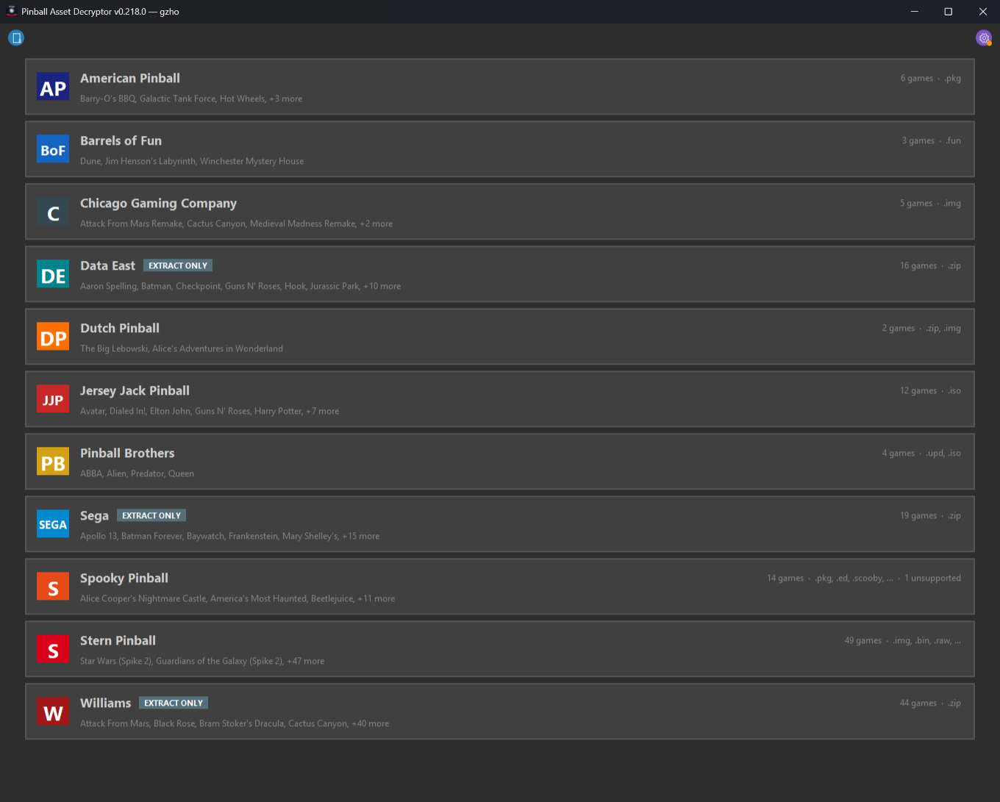
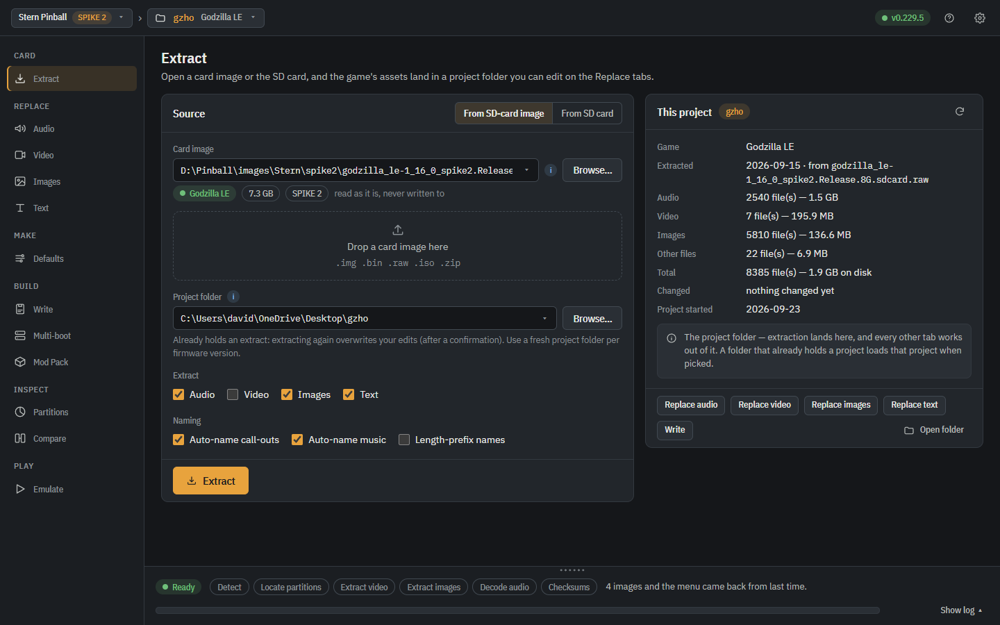

# Pinball Asset Decryptor

Extract, view and change the sounds, videos, pictures and text inside a
pinball machine's software, then build a card or update the machine will
take back. One app for 130+ games across eleven manufacturers, on Windows,
macOS and Linux.

## What you can do with it

- **Extract** a game's assets from its SD card, disk image or update file
  into ordinary files you can open and edit.
- **Replace** sounds, videos, pictures and text, with side-by-side previews
  of the original and yours. Replacements are converted to whatever the
  game needs.
- **Build** a new card image or update with your changes, or write them
  straight onto the SD card or SSD.
- **Share** your changes as a small mod pack, or apply someone else's.
- **Emulate** the game on your PC to see and hear your changes before they
  go near the machine.
- **Multi-boot**: put several complete games on one Stern Spike 2 SD card
  (or Jersey Jack install stick) and pick one from a menu at power-up.

  
  
  
  

## Supported machines

| Manufacturer | Games | What you can do |
|---|---|---|
| American Pinball | 6 | Extract, Write, Replace Audio/Video, Emulate |
| Barrels of Fun | 4 | Extract, Write, Mod Pack, Replace Audio/Video, Emulate (Bon Jovi: extract only) |
| Chicago Gaming Company | 5 | Extract, Write, Mod Pack, Replace Audio |
| Data East (classic DMD) | 16 | Capture DMD animations + sound with PinMAME |
| Dutch Pinball | 2 | Extract, Write, Apply Delta, Mod Pack, Replace Audio/Video, Emulate |
| Jersey Jack Pinball | 12 | Extract, Write, Mod Pack, Replace Audio/Video, Emulate, Direct-SSD, Multi-boot |
| Pinball Brothers | 4 | Extract, Write, Apply Delta, Mod Pack, Replace Audio/Video, Emulate |
| Sega (Whitestar DMD) | 18 | Capture DMD animations + sound with PinMAME |
| Spooky Pinball | 14 | Extract, Write, Mod Pack, Replace Audio/Video, Emulate |
| Stern Spike 2 | 26 | Extract, Write, Direct-SD, Replace Audio/Video/Images/Text, Scenes, Partition Explorer, Emulate, Multi-boot |
| Stern Spike 1 | 6 | Extract, Write, Replace Audio, Emulate |
| Williams (WPC) | 41 | DMD scenes, animations, fonts and sound from the ROM; PinMAME capture |

Game lists, file formats and what each manufacturer's tabs do in detail:
**[Supported manufacturers](docs/guide/manufacturers.md)**.

## Install

Download the latest release for your computer from the
**[Releases page](https://github.com/davidvanderburgh/pinball-asset-decryptor/releases)**:

- **Windows** - `…_Windows.exe`. Run it, then run **Install Prerequisites**
  from the Start Menu and pick the manufacturers you use. Most tools run in
  WSL2, which the installer sets up (it may ask for a restart).
- **macOS** - `…_macOS_AppleSilicon.dmg` (M1 or newer) or
  `…_macOS_Intel.dmg`. Drag it to Applications; the first launch needs
  **Open Anyway** in System Settings → Privacy & Security, because the app
  is not signed by Apple.
- **Linux** - `…_Linux_x86_64.AppImage`. `chmod +x` it and run it, then
  press **Install Missing** in the app's prerequisites row (apt or pacman).

The app checks for updates itself and, on Windows, installs them in one
click. Step-by-step help, troubleshooting and the tools each manufacturer
needs: **[Installing](docs/guide/install.md)**.

## Quick start

1. Launch the app and **pick a manufacturer**. The prerequisites row turns
   green once the tools it needs are installed.
2. On **Select card**, browse to the card image, update file or SD card.
3. On **Extract**, choose a project folder and press **Extract**.
4. Change what you want: on the **Replace** tabs, or by editing the
   extracted files directly.
5. On **Write**, build the new image (or write straight to the card), and
   put it in the machine. Keep a backup of the original first.

The **?** button in the app opens tips for whichever tab you are on.

## Documentation

| Page | What is in it |
|---|---|
| [Using the app](docs/guide/using-the-app.md) | Every tab from Extract to Mod Pack, projects, history and the log |
| [Emulate](docs/guide/emulate.md) | Playing a game on this PC: Stern Spike 2, Jersey Jack, Dutch Pinball |
| [Multi-boot cards](docs/guide/multi-boot.md) | Several games on one card with a menu at power-up |
| [Color profile maths](docs/guide/color-profile-maths.md) | Every step of the Color profile tab, in order, with its limits |
| [Supported manufacturers](docs/guide/manufacturers.md) | Per-manufacturer detail, formats and quirks |
| [Installing](docs/guide/install.md) | Install, prerequisites, troubleshooting, auto-update |
| [Disclaimer](docs/guide/legal.md) | The full legal notes: DMCA, manufacturer EULAs, no warranty |
| [Development](docs/development.md) | Running from source, architecture, adding a manufacturer, tests, building installers |
| [Architecture notes](docs/architecture/README.md) | How each manufacturer's formats and pipelines work |

## Disclaimer

This is an independent interoperability tool, **not affiliated with or
endorsed by** any pinball manufacturer. It ships **no game content**: no
ROMs, sounds, pictures or keys. It works only on files you supply, and is
meant for personal customisation of a machine you own; don't distribute
modified game assets.

Some manufacturers' license terms (Stern's among them) forbid modifying
the machine's software, and they warn that doing so can stop the machine
working or cut it off from their online services. **Always keep a complete,
working backup** before you change a machine: a bad update can leave it
unable to boot. There is no warranty; use it at your own risk, and don't
contact a manufacturer's support about a machine running modified code.

Read the **[full disclaimer](docs/guide/legal.md)** before use; the app also
shows it on first launch.

## License

[MIT](LICENSE). Each upstream decryptor's reverse-engineering work is
credited in its source project; this is the unification layer.
