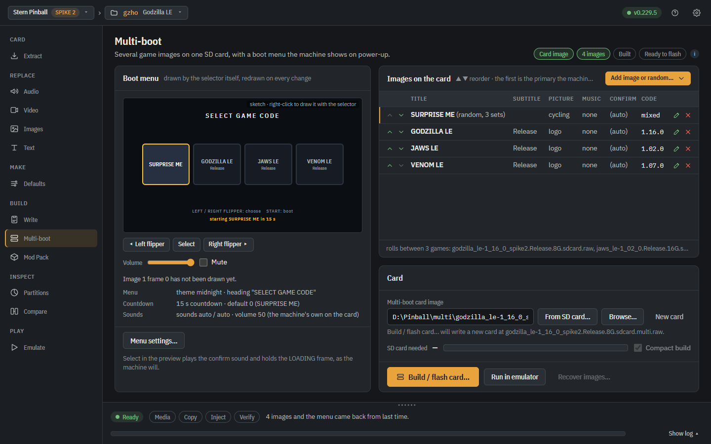

# Multi-boot cards

[← Back to the README](../../README.md)

The Multi-boot tab builds one SD card that carries several complete Spike 2
game images — stock code beside a custom build — and shows a menu at
power-up, drawn here exactly as the machine draws it. **Up to 16 images fit
one card**; from five the menu scrolls three at a time, with a counter under
them, so a card is not limited to what fits on the screen at once. From
v0.204.0 a card in that menu can stand for SEVERAL games and boot one of them
at random, so forty song-set variants of one title become one card that looks
standard and plays a different set every power-up; and from v0.205.0 a compact
card stores such a variant as only its changed songs, so those forty variants
cost a few GB rather than forty copies of the sound library. From v0.209.0 the line across the top of the menu is yours to write, or to leave off altogether; every sound in the tab has a **Play** button that plays it here, on the spot; and a compact card that cannot be laid out names the SD card size the content wants instead of saying a check failed. From v0.210.0 every sound box in the tab also lists the sound files this menu already uses, so putting one clip on all of the images is a pick rather than a walk through the file dialog once per image. From v0.212.0, when the card you need is bigger than the games on it, the strip adds up the two numbers it already showed and says why - and the words and the bar carry the rest: what the smaller card really holds, that the free room is what lets an image be updated in place, and that **Compact build** is the tick that shrinks it; the two confirm-sound boxes also name each other now, so **Menu settings** names the images that carry a confirm sound of their own and will ignore the one in front of you.  From v0.223.1 every card in the menu draws its title and subtitle at ONE size, measured so the longest name on the card still fits and then used for all of them, so a single long title no longer shrinks only itself while the cards either side of it stay large; **Same text size on every card** in **Menu settings** is the tick, and clearing it puts every card back on a size of its own; and the **Confirm sound** box in **Edit image** carries a line under it naming the sound that image will play - the menu's own, the image's own, or nothing at all - so the box and the list's **Confirm** column say one thing.  From v0.225.0 **Edit image** fits any screen: **OK** and **Cancel** are packed against the bottom of the window and the fields above them scroll - bar, wheel and Page keys - when the desktop is too short for the whole form, which **Menu settings** and **Build / flash card** inherit as well; the dialog also draws the card it is editing beside the fields, exactly as the boot menu will draw it, following every keystroke; and what that card's picture comes from is a single list box rather than a column of choices, with the preview answering the question the column was there to answer. From v0.225.4 **SD card needed** counts the GAMES the card will carry, a random set's members included, so adding a random set no longer blanks the number and leaves it blank for the rest of the session; and the size strip is its own refresh button - click it and the list is measured again, which is the way back from a check that failed or an image that was not on this machine when the list last moved and is now.  From v0.226.0 the counter under the cards and the word in front of the countdown are the card owner’s: **Count the cards under them** in **Menu settings** takes the `<  2 / 5  >` line off the menu altogether, and **Countdown says** rewrites the word in front of `<title> in 9 s` - or empties it, leaving the title and the seconds on their own - with the example under the box drawn as the menu will draw it, and a longer word measured against the line it shares and shrunk to fit the glass rather than running off it; from v0.229.5 the loading screen the machine shows while the chosen image starts says that word too, in place of `LOADING`:

From v0.216.1 the tab does the same for a **Jersey Jack** machine: two JJP install ISOs of one game code (the stock code and a retheme built with this app, say) become one multi-boot install stick, and the machine shows the same menu at power-up, drawn by its own PC - flippers choose, START boots, the machine's own volume buttons and the Action button work, the menu keeps its sound to the speakers, and a maintenance reboot boots the same image again without showing it. The stick dialog's **Onto:** row can also install straight onto the game's SSD in a dock on this PC (no stick, no install run on the machine), and on a disk that already holds the install its **Write:** choice replaces only the boot menu, or only one image from that image's own ISO, with the machine's settings and scores kept.

The tab does the same for a **Barrels of Fun** machine (Labyrinth): the stock `lab.fun` and other builds of the same game - a mod such as the Sarah code - become ONE update file, and once it is installed the machine shows the same menu at power-up, drawn on its own screen before the game starts: flippers choose, START (or LAUNCH) boots, and the countdown boots the remembered choice. It is installed exactly as every Barrels of Fun update is, from a FAT32 stick, with nothing opened up; installing any normal update later takes the menu away again. Every build after the first travels as its difference from the first, so two builds of Labyrinth still fit one file on the stick (about 3.2 GB for the stock code and the Sarah code). The menu fills the backbox and has the same pictures, video clips, music, move and confirm sounds and random card as the other machines' menus.

From v0.229.0 a **Mac** builds these cards too. The tab's tools are Linux tools - loop devices, ext4, partclone - and macOS has none of them, which is why the tab used to stop on a Mac; so on macOS the app now runs them inside a Linux of its own, a container it builds the first time you write a card, and it asks for no password at any point because that container's own user is root. Nothing else about the tab changes, and the size check and the preview still need none of it. **Docker Desktop** is the one new prerequisite, and if it is missing or not running the tab says which of the two it is and writes nothing. That Linux is an x86-64 one on every Mac, Apple silicon included: the boot menu the card carries is an x86-64 program linked against the machine's own libraries, and the preview runs it, so an arm64 container could neither build it nor start it. On Apple silicon it therefore runs emulated, and building its image the first time takes a few minutes rather than one.

## The Multi-boot tab

*Stern Spike 2, and from v0.216.1 Jersey Jack Pinball, and Barrels of Fun (Labyrinth) — Windows via WSL2, or Linux*

One
SD card, several complete game images, a menu at power-up. Point the
path box at a new card name, add the images (each one a full Spike 2
card image: the stock code, the card you built with this app, another
build), give each a title, a picture and a sound if you like, and
**Build / flash card…** writes the card and, if you want, flashes it
onto an SD card in the same run — you pick which SD card in the next
dialog, the Write tab's own picker, and nothing is written to one
until you have chosen it there and confirmed. That dialog's **Only the
boot menu** tick rewrites just the menu and leaves the machine's
settings and scores alone; from v0.212.7 it starts ticked only for a
card a flash from this app has already put onto an SD card, and any
other card starts unticked and is written whole. On the machine the flippers move
the highlight, START boots the highlighted image, and a countdown
boots the remembered choice by itself; the first image in the list is
the primary, and the machine falls back to it if the menu ever fails.
The tab previews the menu as the machine will draw it, says which SD
card size the images need — from v0.209.0 by walking the sizes
through the builder itself, so the answer is the one the build will
give, and content that fits no Stern card is told which partition
ran out and that it wants a bigger card, where the strip used to say
only that the size check had failed — and a **Compact build** tick
stores what the images share only once (off by default) — and a variant that
changes a few songs costs only those songs, because the machine
rebuilds its sound file at boot from the base image's copy. Point the path box at a
card you already built and it reads back for editing: a changed title
or picture, or one changed file inside one image, is written into the
card in place in about a minute — no rebuild — and **From SD card…**
reads the menu straight off the card in the reader and writes your
changes back onto it, or reads the whole card into a .raw you name.
A card someone else built loads the same way and draws its own menu,
but it names its images on their machine; **Recover images…** writes
each image back out of the card as a normal card image of its own
(the game as its games partition, the boot menu taken out), copies
the card's pictures and sounds out beside them, and points the rows
at those files — from then on the card is one this machine built:
updatable in place, rebuildable, and open to another image. Every
image on the card boots with its game validator bypassed and its
saved validation grades ignored, so a GAME VALIDATION ERROR an earlier
card left in the machine cannot latch on it. Never update a card built
this way with a Stern USB update; rebuild it here.
**Menu settings** carries the line across the top of the menu from
v0.209.0: it reads SELECT GAME CODE, which is what the machine draws
when nobody has changed it, and typing over it retitles the menu —
emptying it leaves the top of the menu bare. It is shrunk and then
cut to the glass like every other line the menu draws, and a card
that never asked for a heading is still written byte for byte the way
it always was.
**A SETTINGS card at the end of the menu** from v1.62.0: Menu
settings has the tick **End the menu with a SETTINGS card** (Stern,
on by default), and the card, with a gear on it, follows the last
image whenever an image's game carries an adjustable color profile;
the tab's preview draws it in exactly those cases. On the machine,
Settings > Color correction lets the operator change each game's
color correction without a computer: Start from (As built,
Recommended, No change, Black and white), middle shades and color
level per channel, color strength and darkest shades, with the Color
profile tab's test card on the glass corrected live as the values
move, then Save for this game or Save for every game. The saved
values reach the game at its next start: the boot hook copies the
game program into RAM with the new numbers in its drawing shaders
and binds the copy over the original, so the games partition is
never written and any failure runs the program as built. No
countdown runs inside Settings; on the card itself the countdown
boots the game the menu opened on, and two idle minutes leave
Settings without saving. Builds now write the color profile in one
fixed shape so it can be adjusted; a card built with v1.60.x has no
slot to adjust and shows no SETTINGS card until it is rebuilt.
**Every sound in the tab can be heard without leaving it.** A ▶ Play
button sits beside the Browse… for the move click, the confirm
stinger and an image's music, in Menu settings and in Edit image
alike: press it and the sound plays through the preview's own volume
and Mute, either the WAV you pointed the row at or the one the last
preview rendered for that row, so a word like auto or menu is heard
as the sound it actually stands for (on image 3's row, image 3's
sound). The Log says which file played and how long it was, and when
nothing plays it says why. The note beside the sounds also says
plainly that an image's confirm sound plays when you press START on
it, not as you scroll past it — scrolling is the menu's move click,
which is what made a set confirm sound look as though it had not
taken. From v0.223.1 the **Confirm sound** box in **Edit image**
carries its own line under it naming the sound that image will
play, rebuilt as you type: the menu's own sound, this image's own,
or nothing at all when neither has one. It is the sound's NAME,
which is what the list's **Confirm** column shows and what the box
itself cannot show (the box holds the whole path), so the two
panels now say the same thing, and a per-image `none` reads as the
menu's sound everywhere because that is what the card does with it.
**Every sound box also lists the sounds this menu already uses.**
From v0.210.0 the move sound, the confirm sound and an image's
music each offer, under their own words, every sound file the menu
has been pointed at anywhere else, so a WAV browsed in once is a
pick in the other three boxes rather than another walk through the
file dialog — which is what putting one clip on every image used to
be. The list is rebuilt each time a box drops open, so a file chosen
a moment ago in another box is already on it, and picking a name
sets that file exactly as Browse… would. They are listed by file
name, because a dropdown is only as wide as the box above it and
every path on one machine opens with the same few folders; two files
that share a name are told apart by their folder. Only files on THIS
PC are offered: a card built on somebody else's machine loads with
their paths recorded in it, and those are not sounds this one can
read.
**The move sound never plays over itself.** From v0.212.3 a flipper
press while the move sound is still playing moves the highlight and
leaves the sound alone, on the card and in the tab's preview alike,
so a long clip is heard once however fast you flip instead of piling
up a copy per press, and a move sound taken from a file is cut to
3 s with a short fade. **Run in emulator** draws the menu with the
card's own heading, theme and colours, its sounds keep time with the
flipper presses where they used to fall seconds behind, and the
countdown reads `starting <title> in N s`.
An image's picture can come from a video clip — one frame of it, or a
short loop of it as the card's animation — and from v0.208.1 that
picture is taken from a track the clip actually has a decoder for. A
video file can hold more than one video track, and ffmpeg reaches for
the biggest one rather than a readable one, so a single track in a
format this machine cannot decode ended the whole build on
*Decoding requested, but no decoder found for: none*, with the clip
that caused it named nowhere. The art now comes off the first
decodable track — still frame and animation alike, at that track's
own frame rate. When nothing in the clip can be decoded the build
says which file it was, the four characters its picture is stored
under, and to re-export it as an ordinary H.264 `.mp4` from whatever
plays it; a file that holds no video at all says that instead, since
an audio file under a video file's name looks the same from here.
For a **Jersey Jack** machine the same tab takes two JJP install ISOs of
one game code — the stock code beside a retheme built here — and
**Build / make stick…** writes one multi-boot install ISO and turns it
into an install stick (boot files first, so the machine's BIOS finds
them; use a USB port on the computer in the backbox, the cabinet's
front slot can be thirty times slower). The machine installs it as it
installs any JJP stick (the purple security key in, as always, and the
install wipes settings and scores as every JJP install does), and from
then on shows the menu at power-up: flippers choose, START (or the
Action button) boots, the coin-door and cabinet volume buttons set the
menu's level, and a maintenance reboot boots the same image again
without the menu. The stick dialog's **Onto:** row offers the game's
SSD in a dock instead of a stick — the app installs it on this PC by
the same steps the machine's installer would — and, for a disk that
already holds the install, its **Write:** choice replaces only the boot
menu (after an in-place change to the ISO's titles or clips) or only
one image from that image's own install ISO, keeping the machine's
settings and scores. Both images must be the same game version, since
they share one settings partition; the tab refuses a mismatch and says
why.

For a **Barrels of Fun** machine the tab takes the stock `.fun` first and up to three more builds of the same game, and **Build update…** writes one multi-boot `.fun` under the game's own name (`lab.fun` for Labyrinth), which is what the machine's updater looks for on the stick. Copy it onto a FAT32 USB stick and install it the way every Barrels of Fun update is installed. The install puts the first build in place as a normal update would, rebuilds every other build from it and checks each one, and shows the menu from the next power-up: flippers choose, START or LAUNCH boots, and the countdown boots the build chosen last. A build that does not check out is left out of the menu, and with only one build left the machine starts as it always did. Each card can have a picture or a video clip of its own, music while it is highlighted and a confirm sound, and **Add random over the images above…** adds a card that boots one of the builds at every power-up while they keep their own cards. A card's *auto* picture and clip are that build's own title or attract video, taken out of its `.fun` (a mod that changed the attract shows its own), and a random card's styles are drawn from those; *auto* music is that build's own too (stock plays the game's "Into the Labyrinth" theme, a mod that changed its intro plays that intro's soundtrack), and the *auto* sounds are the game's own menu click and its clock bell. The sounds play through the machine's own `aplay`, which is stopped before the game starts so the game finds its sound card free. All the builds share the game's one set of settings and scores. The size strip says how big the update comes out; a FAT32 stick holds no file of 4 GB or more, so builds that differ a lot from the first may not fit, and the strip says so. Installing any normal update afterwards removes the menu and its files and puts the machine's own startup back. Labyrinth is the title whose updater has been read; Dune and Winchester update differently and are refused by name for now, and Bon Jovi's updates are signed and cannot be rebuilt at all.
