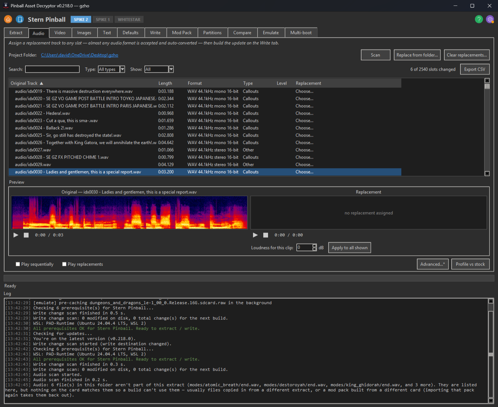
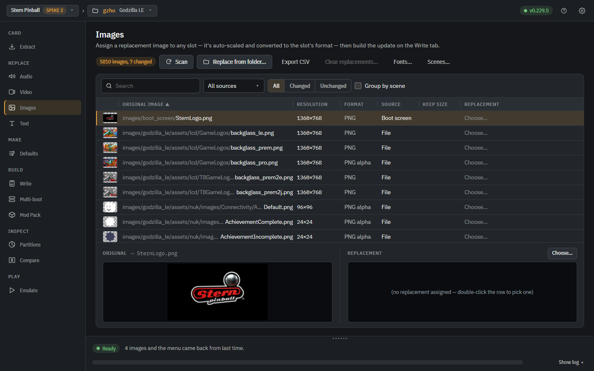
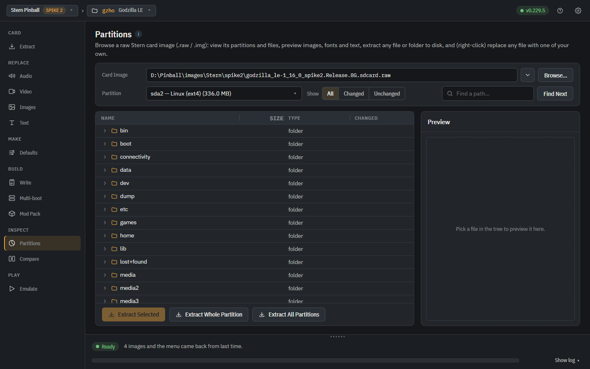

# Using the app

[← Back to the README](../../README.md)

A walk through the app from launch to a finished card: the picker,
extracting, replacing sounds, video and pictures, building the card,
and sharing a mod pack. Emulating a game on this PC and multi-boot
cards have pages of their own: [Emulate](emulate.md) and
[Multi-boot cards](multi-boot.md).

## Getting started

1. On launch, the **picker** shows a card per manufacturer with every
   compatible game listed (greyed + struck-through for ones not
   currently decryptable — e.g. Spooky's Total Nuclear Annihilation,
   AES key unknown). Click a card to enter that manufacturer's view.
2. The **prerequisites** row at the top of the mfr view turns each
   needed tool green (✓) or red (✗); hover for an install hint. Once
   everything is green the row tucks itself away — the **⚙ settings
   menu** (top-right) keeps the status plus the Re-check / Install
   actions, along with the light/dark theme switch, update check,
   disk-space manager and voice-recognition quality (including a
   one-click reset of the downloaded voice models).
3. **Select card tab** — Browse… to the card image (or pick the SD card
   itself). As confirmation it shows what the machine puts on the screen
   while it starts: the game's own loading screen, or on a multi-boot
   card its boot menu with the default game highlighted (drawn by the
   Multi-boot tab's own tools, a few seconds the first time). Under it,
   **Card details** lists everything the app can read off the card —
   firmware version, edition, games on it, asset counts, partitions —
   with Copy for a bug report. On a Stern Spike 2 card an *Official
   release* row says whether the card is Stern's own release or one that
   was changed (built by PAD or another tool); after an extract a deeper
   check runs in the background and the Extract tab's project card shows
   the verdict in a *Stock* row. Its *What you can do with it* panel sorts
   the other tabs into what works straight from the card, what needs a
   project folder and what needs an extract. Tabs that need an extract
   (Replace Audio / Video / Images / Text, Mod Pack, and Write on
   machines that only build updates) are greyed out with a lock until
   there is one; they still open, under a banner that says why. Write
   stays open on Stern, JJP and CGC, whose Build / flash dialog can
   write an existing card image onto an SD card with no project at all.
   A multi-boot card picked here is read into the Multi-boot tab when
   you open it. Picking a different card while a project holding
   another card's extract is open (and the new card has no project of
   its own) opens the **New project** window filled in for that card —
   a folder named after its game, beside the open project — so its
   work does not land in the other card's folder; *Stay in <project>*
   keeps the open one. The panel shows the same warning with a **New
   project for this card…** button until you choose.
4. **Extract tab** — shows the picked card; choose an output folder and
   click *Extract*. The output folder gets the decrypted assets plus a
   `.checksums.md5` baseline used by the Write tab.
   In **From SD card** mode (Stern Spike 2) the game on the card you
   picked is named right under the dropdown — read off the card in
   place, with nothing copied anywhere — so a stack of cards on the
   bench can be sorted out by plugging each one in and reading the
   line; a card carrying a boot menu says so and how many games are
   on it. Card details on the Select card tab reads the rest off the
   card itself: firmware version, edition, asset counts and
   partitions. Reading a card in place
   needs Administrator on Windows, and the line says so when it
   hasn't got it.
   **Save card as image…**
   next to the card picker copies the card itself into a `.raw` file
   first — the exact reverse of the Write tab's flash, and the backup
   to take before you mod a stock card. It shows the card's size
   against the free space where you're saving, won't let you save onto
   the drive it's reading, and only names the finished file when the
   whole card has been read, so a read you cancel or a disconnected
   reader can't leave a short file sitting there looking like a
   backup. It asks for Administrator the same way flashing does, and
   changes nothing on the card.
   If the source image later stops being the file you extracted from —
   swapped, reverted or rebuilt outside PAD — a banner says so, because
   the "Original" names on the Replace tabs then describe assets that
   image no longer holds. Re-extract to resync, or press **Dismiss** to
   accept it: the dismissal is pinned to that exact image and is stored
   in the project folder, so it holds after a restart and lifts by
   itself the next time the image changes.
5. Modify any files in the output folder you want to change.
   *(BOF specifically:* edit the human-friendly files under
   `pck/_EDITABLE ASSETS/audio|images|video|fonts/` — drop in a new
   `.wav`, `.webp`, `.ogv`, or `.ttf` with the same filename and the
   Write pipeline re-encodes it back into the matching Godot binary
   for you.  You don't need to touch the raw `.sample` / `.ctex` /
   `.fontdata` files.)*

## Replace Audio tab

*file-based plugins*

Swap a game's music /
sound effects without copy-pasting and renaming. Scan the assets
folder, pick a slot, and assign a replacement in almost any format
(mp3, wav, ogg, flac, m4a, …) — it's auto-converted to the original
track's codec / sample-rate for you. The original and your replacement
sit in side-by-side seekable-spectrogram panes, each with its own
play/stop transport, so you can A/B them (starting one pane pauses the
other). Where the extract classifies (Stern auto-naming, callouts.csv),
a **Type** dropdown filters the list to one kind of audio — Music,
Sound FX, Callouts, or Other — so you can work through just the
callouts without scrolling past everything else. Right-click →
**Rename…** corrects a slot's name in place; the name is remembered
by the sound's content fingerprint and reapplied automatically on
every future extract, *before* the transcriber runs, so a callout
Whisper keeps mis-hearing stays fixed once you've named it — and the
slot keeps its Type bucket. On Stern titles carrying a Sound Test
menu the sounds it names arrive **already named by the game itself**
(`idx0091 - SE FX MATCH.wav`), and the Rename dialog offers the full
menu listing as suggestions (from the `sound_test_names.csv` the
extract writes): play a number on the machine's Sound Test menu and
either confirm what the extract called that slot or pick the entry
yourself. Tick **Play sequentially** and a clip that finishes
selects and plays the next row on its own, following whatever sort,
search and Type filter you have set, so you can listen through a
whole card hands-free and stop on anything that needs attention.
Add **Play replacements** and every row that has one plays
the replacement instead of the original — the list sounds the way
the built card will, so anything that still sounds stock is a clip
you haven't replaced yet.

### Longer sounds on Spike 2

On Spike 2 a replacement is normally fitted to the sound it replaces, so
a longer clip is trimmed: the card's sound bank records where every sound
starts, and lengthening one in place would strand all the rest. An
Advanced Audio option instead appends your audio past the end of the bank
and points a copy of that sound's record at it, so every other sound on
the card is untouched. It is opt-in because it needs an image build rather
than a direct-SD write, and longer cues have been confirmed playing on a
real machine. Before v0.219.5 the option never reached a clip assigned on
the Replace Audio tab (the tab cut it to its slot first); it now does, and
a build that can't grow the bank logs each trimmed sound with its length
before and after. The game itself sets the ceiling: it can open a sound
bank only up to about 2 GB, which is roughly 45 minutes of lengthened
stereo sound in one build, so from v0.219.6 the longer sounds are fitted
into the room left and the rest are trimmed with a warning. From v0.221.0
every grow build says in the log how much of that bank it used and about
how many minutes of stereo are still free, whether or not anything had to
be trimmed, and you choose which songs win the room: right-click a sound
on the Replace Audio tab and pick **Keep this song whole if the bank fills
up**, and the ones you marked are fitted first, in the order you marked
them, instead of whichever happen to have the lowest slot numbers. A card
an earlier build already grew is not grown again: its
grown sounds keep their longer slot, and anything longer is trimmed with a
note to build onto a card that was never grown, such as the stock card.

### Music modes

On Spike 2 Godzilla (Pro and Premium/LE 1.16) one card can carry more
than one set of sounds, and the machine's service menu picks which set
plays: **Music Mode** under Adjustments > Machine Settings > Audio
Content. Right-click a sound and pick **Music modes** > **Mode 2 (Custom
A): choose a sound…** to give it a file for that mode; modes 2 to 4 are
offered and **Add a music mode…** adds more, up to 8. Mode 1 is the
sound as it plays now, and a sound with no file for the chosen mode
plays its mode 1 sound. One file can go in several modes and takes the
sound bank's room once. **Name the music modes…** puts the names on the
machine, in the setting's help line (shortened to fit when there are
many modes or long names); the machine offers modes up to the highest
one any sound has a file for. A mode's file follows **Allow
replacements longer than the original** like a replacement: on, it plays
at its full length; off, a file longer than the sound it stands in for
is cut to that length. Some songs play in parts: a short opening the
Sound Test names ("SE GZ MX TUNE 16") and then a longer piece of music
with no name of its own, often looped. A file for the opening part plays
in place of the whole song, once or looped as the song was, so its
length is the whole song's. Each music mode's file has its own loudness: **Music
modes** > **Loudness of mode 2's sound…**, or play it from there and use
the box beside the Replacement preview. A sound's own **Loudness for
this clip** is for its own replacement only; it never reaches its mode
files, and a sound with no replacement keeps its stock sound as it is.
Music modes need an image build, not a direct SD write, and every mode
file takes room in the sound bank.

### Editions

On the same games, one card can also hold several editions of the game
(a Standard look and a 70th Anniversary look, say: other colour
profiles, scenes, pictures, clips or sounds), and the service menu picks
which one boots: **Edition** under Adjustments > Machine Settings >
Attract Mode. Each edition is its own project from the same card. On the
Write tab, **Name the editions...** gives every project the same names
in the same order, and its Write puts the setting in the game's menu.
On the Multi-boot tab add the images edition 1 first, tick **Compact
build** so an edition only takes the room of what it changes, and tick
**No menu: boot the edition the game's EDITION setting names** in Menu
settings. The card then shows no menu; a change to the setting takes
effect at the next power-up. The editions share the machine's settings,
so they must all carry the same ones: give every edition music modes, or
none.

### What the replace tabs look like

  
  

## Replace Video tab

*file-based plugins*

The same idea
for video: assign a replacement clip and it's re-encoded to the
original's container / codec / resolution (transparency preserved
where the original has it). Original and replacement preview
side by side, each in its own embedded player. To color grade
several clips against each other, **Compare** (in the page head, or
a row's menu) opens up to four players in a grid beside the Colors
bar: each shows its Original or Replacement with its own color
switch, the one you click is the bar's target and the only one with
sound, and Play all / From the start / Loop keep them in step. A game's
own clip is marked **Locked** on its player, and the **Advanced** box at
the top of Compare unlocks it there as on the list; with its color
profile attached it shows **With its color profile** (on the list too,
in the right-hand player). Under each of the list's two players,
**Original** (or **Replacement**) and **With its color profile** switch
that player between the clip as it is and the clip through its color
profile, attached or not; only the player changes. On Spike 2 every player draws its clip
through its colors the way Scenes draws a picture, color ranges and
curves included, frame by frame as it plays. The Big Lebowski's colour-DMD `.cdmd` clips are supported
too — they're re-encoded back into `.cdmd` at the original frame
count so they stay in sync with their sound. If you would rather
encode your own clips than let the app convert, right-click a slot
and pick **What this slot needs…**: it reads that slot's own clip
and gives you the container, codec (with the H.264 profile and level
where those apply), frame size, frame rate and whether it carries
audio, plus a copyable ffmpeg command written in that slot's own
codec, pinning only the flags that have to match — so your own
bitrate and key-frame settings stay yours. Get everything
but the container right and nothing is re-encoded: a clip that is
already this slot's video in the wrong wrapper is repackaged with a
stream copy, so every frame survives untouched. On Stern Spike 2 the
MP4-vs-QuickTime wrapper is not a difference at all: the machine
plays either, so a clip that is otherwise a drop-in for the slot goes
on the card as your own bytes even when the card's own clip was
written in the other one. And when a clip really does have to be
re-encoded, the line for it says which property forced that — "it's
640x480 and this slot's clip is 720x540" — instead of naming only
the shape it was converted to. The **Convert**
column tells you which of the three you are getting — `As-is`,
`Repackage` or `Re-encode` — before you build.
From v0.219.2 a `Re-encode` is made at the bitrate of the clip it
replaces (never below a floor well clear of blocky), still inside
that slot's size, and the build log names both rates ("encoded at
… (the clip it replaces is …)"). Older versions used
the encoder's default quality, which put most converted clips on
the card at around 1 Mbps however well you had exported them.
From v0.219.0 the toolbar also answers the other question — how do
the clips ALREADY on a finished card look? **Check card…** opens a
report over any card image and measures every clip on it by the same
rule the build warning uses, worst first, so a card you built a year
ago can be checked without its build log. It separates the two cases
that matter: a clip the app squeezed into its slot, which a rebuild
puts on whole, and a clip that is simply small. A small clip is
either your own file, on the card exactly as your encoder made it,
or a converted copy an older version made far below Stern's bitrate
— and building again from your original replacement files fixes
those. Nothing is written — the card is opened read-only.
**Best quality (Stern Spike 2).** Tick *Best quality* and every
`Re-encode` is made at full quality instead of the bitrate of the
clip it replaces: each clip gets the bits its picture needs, more
than the stock clip for a detailed one, fewer for a simple one.
Build for a 16 GB or 32 GB SD card on the Write tab when they don't
fit. Converted clips are kept in the project, so the next build only
converts what changed. **Best quality…** on the toolbar also finds
your files when the project doesn't know them (a card built on
another PC, clips picked from files named nothing like the slots):
pick a card built with your videos, the stock card and the folder
your videos are in, and every clip that card replaced is matched to
a file in the folder by what it looks like — names and file types
don't matter, a colour clip is told from its black-and-white twin,
and where the folder holds the same video more than once the best
copy wins. Tick what you want and *Use these files at best quality*.
**Random clips (Stern Spike 2, Godzilla Pro and Premium/LE 1.16).**
Right-click a row and pick *Random clips → Add clips to play at
random…* to give that slot more clips than its own: each time the
game plays the slot's clip it plays one of them instead, at random,
never the same one twice in a row. The slot's own clip (the game's,
or your replacement) is one of the turn. The row shows a shuffle
badge with how many extra clips it has, the note under the players
names them, and the same menu takes each one off again. It works for
the clips the game plays by name (the in-game video bank: modes,
battles, awards, bonuses); a clip a scene plays on its own, like an
attract loop, says *Why not this clip?* instead. The extra clips are
converted to the slot's format like a replacement and added to the
card as new files, so it takes an image build (not a direct SD
write), and the card gets a small program that does the picking.
It does nothing else, and the machine still reports its scores to
Insider Connected.
**Played in (Stern Spike 2 titles whose modes the app can tell apart,
such as Godzilla).** The *Played in* column names the battles,
multiballs and other modes of the game that play each clip, read from
the card's game program, and the list beside *All / Changed /
Unchanged* shows one mode's clips only. *Other parts of the game*
are clips only main play, attract or the select screens use; *Not
played* clips are ones nothing in the game asks for, so the machine
never shows them and a replacement there changes nothing. A clip two
modes share (on Godzilla 1.16: two clips of the Gigan battle and the
Ghidorah and Gigan tag team, one of Battle vs Megalon and the Megalon
and Gigan multiball) has a row for each mode: the second row, marked
with an arrow, says *Same clip as* the first until you choose a
replacement in it, and then only that mode plays yours. That mode's
clip goes on the card as a new clip, so it takes an image build (not
a direct SD write); clear the replacement and the row follows the
first again.
**Sounds with a clip (Stern Spike 2).** A clip and its sound are
separate files on a Spike 2 card, named differently, and nothing in
the file names links them. The game's program does, and under the
panes the tab lists the sounds the game plays with the selected clip:
*kept with the clip* (the game stores the clip and its sound
together), *asked for right after it* (the code that shows the clip
asks for the sound next to it), or *named after it* (the sound's Sound
Test name is the clip's name). Each sound is named by its file in the
project's `audio` folder once the card has been extracted with this
version (the extract writes `sound_requests.tsv`); before that, by its
Sound Test name or its request number. Played in the emulator, 110 of
115 of these sounds played with their clip. Not every clip gets one:
a sound the game picks at random or works out while it plays, or one
a clip carries in its own audio track, is not listed.
**Undo and Redo.** The *Undo* and *Redo* buttons at the top of the
tab (Ctrl+Z; Ctrl+Y or Ctrl+Shift+Z) take back, or make again, your
last changes one step at a time: a pick, a clear, Replace from
folder, a clip's own conversion, length, colors or random clips, and
the boxes over the list. The history lasts until the app closes or
another project opens.

## Write tab

The original image and project folder carry over
from the Extract tab (shown read-only), and a single **Build
Image** line shows the exact file the build will produce; click
*Build update*. The default name ends in `…-modified` with the
extension the build must carry (Stern Spike 2 = `.raw`, CGC =
`.img`) already applied, and *Change…* is one Save-As picker for
both the folder and the name, so a renamed build can never come
out extensionless or in the wrong format for your flashing tools.
You get an installable file that's ready for a USB drive (SD-card
plugins default the name to `…-modified.raw` so it can't be
mistaken for the stock image).
Where whole-card flashing is supported (Stern Spike 2, CGC), the
single **Build / flash SD card…** button replaces the plain Build
button and does the whole test loop in one step: a two-part dialog
builds a fresh image and/or writes an image onto a card — tick both
and the fresh build goes straight onto the card, no separate flash
step. (Untick building and it's the classic "flash a pre-built or
backup image" dialog.) The dialog opens on whichever pair you ran
last, remembered per manufacturer and kept across restarts, so a
build-only or flash-only habit doesn't have to be re-ticked every
time. Action buttons are colour-coded — green for
go actions (Extract, Build), red for the live Cancel and Revert all
changes — with neutral buttons (Browse, Refresh) left plain.
Any Replace Audio / Video assignments are applied automatically
here — no extra step. If those picks were made against a *different*
project folder, the warning before the build now shows both paths
together — the folder being built and the folder each set of
assignments belongs to — says which field to change (**Project
Folder** on the Extract tab, the only editable copy of that path),
and, when the folder being built has replacements recorded of its
own, says the build applies those instead of calling the image
unmodified. From v0.221.1 a build onto a card the project folder
was *not* extracted from asks first as well: it names both cards and
spells out what a build carries — this folder's replacements and the
files you changed in it, with everything else coming from the card
being built — so mods an earlier build baked into the recorded card
are not on this one, and points at **Transfer mods → new
version...** as the route that does carry them over. Building onto
another card stays legal (it is how a mod moves to a new game
version), so it is a confirm rather than a refusal, and the same
sentence goes into the build log, where it answers "why is my card
stock again?" in a log posted days later. The **Modified Files**
list sorts on any
column header (File, Type, Status — click again to flip, a third
time to restore the scan's own Pending-above-Modified order) and an
**Export CSV** button saves the whole list, so two projects that
disagree on their change count can be diffed in a spreadsheet.
The assets folder *is* your project: your picks and built
changes persist there across app restarts, so you extract once and
keep iterating (no re-extract per edit). Each Replace tab marks slots
already changed by an earlier build, and **Revert all changes…**
(plus a per-slot *Revert to original*) puts files back to their
extracted originals — instantly from a per-edit backup, without
re-extracting.
From v0.208.0 picks can be dropped in bulk as well as one at a time:
select a range of rows (click, then Shift-click, or Ctrl-click to add single
ones — sort by the **Replacement** column first and everything you
have picked sits together) and right-click the selection, or press
**Clear replacements…** beside the project folder to drop every pick
on that tab. Clearing takes the replacement back out: a pick nothing
has applied yet is simply dropped, and from v0.212.5 a slot a build
or an emulator Start already wrote into the project folder gets the
card's original file put back too. Nothing of yours is deleted; a
slot changed some other way (copied over by hand, or built before the
app kept a saved original) keeps its bytes, which is what
*Revert all changes…* is for.
From v0.218.0 a whole set reworked outside the app (every clip made
black and white, say) goes in the same way with
**Replace from folder…**, beside it:
choose the folder holding your files and each one is picked for the
slot with its name. The file type and capital letters don't have to
match — a converter that writes `.mp4` for everything still fills the
card's `.mov` clips, each converted to suit its slot — and subfolders
are fine. Leave the extract's own files where they are: a file dropped
into the project folder only counts under the card's exact name, and a
Replace tab row reading **not on this card** says which card file it
was meant for. Scene pictures and font glyphs are named with a
fingerprint of the card they came off, so copies from another card's
extract never pair by name; **Transfer Mods to New Version** carries
those over by content.
**Find originals…**, beside it on the Audio and Images tabs, is the
same search by content for your own files. Carrying a built card's
mods into a project with *Transfer Mods to New Version* picks the
card's own copy of every replaced sound and picture, which the build
that made that card had already converted once. Point Find originals
at the folder your own files are in and every pick on the tab is
compared with every file in it by how it sounds or looks, so names,
levels, sample rates, sizes and file types don't matter; where the
folder has the same file twice, the better copy wins, and files that
are part of an extract (copies off a card) are never offered. Each
row shows the copy and the file found side by side (▶ for a sound, a
thumbnail for a picture) and amber rows are worth a look. Tick what
you want and *Use these files*: the next Write converts from your
originals.

## Mod Pack tab

Share just your changed files as a zip, or apply
someone else's mod pack on top of an extracted folder. A pack holds
**every change made since that folder's last Extract**, not just the
current session's, and records which card image and version it was
built from so Import can warn you when you're applying it to a
different firmware. Import checks the pack against the extract you're
applying it to and writes only the files this card actually has: a
pack built from a different card (an LE pack dropped on a Pro extract,
say — the two share a version number, so a version check can't see it)
is named as such and pointed at *Transfer Mods to New Version*, one
that fits nothing at all is refused instead of emptying itself into
the folder, and strays a previous import left behind are cleaned up.
Until they are, the Replace tabs own up to them: a stray row reads
**⚠ not on this card** instead of the blue "changed on disk" tick,
and its Replacement pane says no original was overwritten and the
next build can't place it.
The confirmation box says what will land, what will be skipped and
what will be removed before anything is written, and its **Details**
button expands into the full list — every skipped file by name, each
with the reason it isn't being applied (no slot on this card has that
name, so it stays in the zip; or it's a stray an earlier import left
behind and this one takes back out). The log names them one per line
too, so the list is still readable after the dialog is gone. A pack
also carries
your staged **Default Settings**, high-score defaults and your
image/scene names, which are project settings rather than files, and
merges them on import (the pack wins per setting, anything you'd
already staged here survives). Files you replaced on the card image
itself with the Partitions tab can't be *applied* by an import — they
live in the `.raw`, not the project folder, and putting one back means
resizing inside the card's own filesystem — but the pack carries your
copies of them whenever the file you swapped in is still on the
exporting PC, and Import drops them into the project's `card_files/`
folder under the same on-card path, ready for one right-click
*Replace* on the Partitions tab. Any whose source file has moved since
are named at export *and* again at import as the short list to redo.
Those copies are deliberately invisible to the Replace tabs and to the
extract baseline, so they can never list as slots this card doesn't
have. A Stern project's **music modes** travel too: the pack holds the
files you gave each sound for its other modes (wherever they sat on the
exporting PC), with the modes' names and each file's own loudness, and
Import puts the files in the project's `Music mode files/` folder (as
invisible to the Replace tabs as `card_files/`) and points the sounds
at them. *Transfer Mods to New Version* moves a sound's music modes
with it, by the same content match its replacement uses. Pipeline working files
(decrypted blobs, raw
`.img`s) are left out, so a pack weighs what its assets weigh. For Stern
Spike 2 (where new game code re-lays-out the card), a **Transfer Mods
to New Version** panel pulls your mods from an old extract onto a
fresh one via four explicit inputs: your old (modded) extract, the new
stock extract, an *optional* clean extract of the old version (fill it
to also carry audio and text and to avoid mistaking the factory's own
between-version changes for your mods; leave it empty to compare old
against new directly for images and video), and the new version's card
image to build onto. A video slot's *random clips* (Video tab) go
with the slot just as its replacement does, and a card that was
built with random clips gives them back from its extract too.
Audio is matched by *sound content* so a
replacement follows its sound even if its index moved, and a slot that
changed or vanished is flagged rather than silently mis-applied. From
v0.147.1 that comparison reads each slot's saved pre-edit original, so
it works the same from a project you have already built as from a
freshly extracted one. From v0.148.0 a card's sounds also decode the
same way on every extract, so the two sides of a transfer agree about
what a sound *is* — before that, which sounds landed on a
second-way-in decode of the same codec came down to how the extract
happened to split across worker processes, and the handful that
disagreed were the clips that quietly failed to come across.
Extracts already on your disk still pair: a sound that is the same
sound one frame apart is recognised as a match instead of dropped.
And the transfer now writes the whole plan to the log before the
confirm dialog opens — every sound that moved to a new index (with
both ends of the move) and everything that can't be carried, with the
reason — so you never have to diff two folders by hand to find out
what didn't make it. From v0.187.5, leaving the optional clean
old-version extract empty says so in the log as well as in the
confirm dialog: that the compare can then carry images and video
only, and which sounds or strings it could not match, so a
finished transfer's "0 audio, 0 text" does not read as a failure
once the dialog is gone. From v0.189.1, transferring the same old
extract onto the same folder a second time REPLACES the first run
instead of stacking on top of it: whatever that run staged and this
one no longer finds goes back to the slot's own original, while any
slot you have since re-pointed yourself is left alone, and how many
assignments are being replaced is named in the confirm dialog, the
completion dialog and the log — so a sloppy first attempt can simply
be redone rather than unpicked by hand. The same release lines the
two old-version text lists up on the strings they share rather than
by position, so a run whose string lists differ in length now carries
every string it can match (and names the ones it skipped) instead of
dropping the text side altogether. From v0.189.2 every audio
replacement the transfer can NOT carry says why on its own log line:
the byte length of the stock sound it was replacing, and which slots
in the new version are exactly that length but hold different audio.
When a whole block of failures lines up that way, one extra line says
how many — that pattern means one of the two folders was extracted by
an older release rather than that the sound was re-recorded, so
re-extracting both with this version and running the transfer again
is the fix. From v0.196.0 the strings a transfer could NOT line up
are named, not just counted: the log quotes each one under the asset
it came from and says which of the two old-version extracts it was
in, so you can tell at a glance whether the skipped text was one of
your own lines or something the factory reworded on its own. Sound
slots that exist on only one side, and text assets the modded
extract does not have at all, are listed the same way, and the
confirm dialog points at the log for the list. From v0.199.0 that list is also written out in full: the log block stops at 40 lines so one card can't push the rest of the run out of the pane, and the complete list — every unpaired string entire, never shortened, grouped by the asset it came from and by which extract it was in, plus the text assets the modded extract does not carry at all — goes to `logs/unmatched-text.txt` beside that project's own `project.log`, with the log naming the path on the very next line. Image
edits (including single-character font-glyph edits) and your renamed
image-group names ride along too, matched by their on-card identity so
they land on the right slot even when the new firmware re-baked the art
and renamed every file. From v0.128.0 your staged **Default Settings**
come across too — the operator settings and the factory high-score
slots, keyed by the firmware's own names, so anything the new image
doesn't carry is skipped and anything you already staged on the target
wins. The panel is also how you move mods **between the two models of
one game**: point it at your Pro extract and a fresh Premium/LE
extract (or the other way round) and whatever the two share
transfers. From v0.147.0 that carries the video and image mods too,
not just the audio: every on-card path starts with a folder Stern
names after the model (`godzilla_pro` on the Pro card,
`godzilla_le` on the Premium/LE build of the same title), and the
panel swaps that one component so the two models' asset trees line
up. It
works even for code modded outside this app (mods baked into the game
itself), reads a version hint from each of the four fields so you can
see what you're combining (from v0.199.0 the optional old-version
stock extract reports its version too, so the reference you picked
can be checked against field 1 at a glance instead of on trust),
and wires the build straight to the new version so
the result can't accidentally come out on the old code. From
v0.222.0 a project folder that was itself extracted from a card this
app built says so up front: on its own only the replacements
assigned inside that folder transfer, because the mods already baked
into the card it came from are the folder's starting point rather
than edits. Fill the optional clean old-version extract and the
transfer offers to carry BOTH in one run - the baked-in mods
compared against that stock extract first, then the folder's own
replacements on top, which win on any slot the two share - so a
working folder that has been built, re-extracted and edited again
keeps everything without fetching the old card back.

## Compare tab

**Compare** sets two things side by side. Pick two card images with **Image…** to see what changed between two versions of a game, or two project folders with **Folder…** to see what differs between two extracts of your own: the tab lists every sound, video, picture, text file and other file as Added, Modified, Moved or Deleted, plus a **Project settings** section for the tab settings and color profiles that differ. Folders are read as they are now, so a replacement you picked shows as Modified; sizes settle most files and only the rest are read, with an "N of M files read" line while it works. Opening a folder row opens that file itself. Folder compare works for every manufacturer the app extracts, and the last folder pair is remembered.

## Partition Explorer

And the Partition Explorer browses the raw card image's ext4 filesystem
directly — no mounting, no WSL — previewing images and fonts as pictures
alongside text files, tracking which files you've replaced on that image
in a **Changed** column, and right-click **Replace with…** swaps any file
on the card for one of your own, at any size:

## Back to the picker

**< Back** in the top bar returns to the picker. Each manufacturer
   keeps its own log scrollback, so coming back to the same one
   shows your previous activity intact. The app also remembers the
   manufacturer you last worked on and opens straight into it next
   launch instead of the picker.

## Projects, history and the log

Two quality-of-life touches apply everywhere: every file/folder box
keeps a per-manufacturer dropdown of your recent paths (handy when you
bounce between games), and the **?** button in the top bar opens a tips
page for whichever tab you're on.

Working several game versions at once? Every extraction folder is a
**project**: the folder you extract into carries a hidden project file
recording the manufacturer, the stock image it came from, and every form
on every tab — the Extract options, the Write file name and build
location, the Emulate card and its ticks, the Multi-boot form, Compare's
two images, the Partition Explorer's image and the Mod Pack transfer —
so picking that folder again later restores the whole setup in one go
(the active project's name shows in the title bar). Opening or creating
a project never leaves the last project's entries on screen: a field
the project never set starts empty. What stays app-wide describes you
or your cabinet, not a card: theme, window, volumes, the Emulate
country and power, and the Default Settings presets.
There's nothing to manage — the project file appears automatically the
first time you extract into a folder or stage a change.  The blue
**folder button** next to Home holds the project actions: **New
project…** starts a clean folder (with a preview of the structure it
builds), **Save project as…** forks your current project — a plain full
copy of its edited state, minus the rebuildable `build\` output — and
**Projects…** lists every project the app has seen with sizes on disk,
notes, and an **Archive** action that shrinks a dormant project to just
its unique bytes (opening it later re-extracts to refill the rest).
The Extract tab's **Project Folder** is the single source of truth:
the Replace/Write tabs show it read-only, and the build lands in the
project's own `build\` folder (changeable per project in Properties).
An **ⓘ** button beside the folder pops up the project's stats at a
glance — audio/video/image file counts and sizes, total size on disk,
how many files are staged or already changed by builds, and when the
project started — and once a card is recognised the **window title
names the detected game and firmware version** (e.g. "Led Zeppelin
v1.22.0 LE") alongside the project, so several open versions stay
tellable apart in the taskbar.
Every project also keeps its own **change history**: each replacement
pick (with the file it replaced), text edit, staged default, build and
revert is appended with a date and time to a `.history.log` at the
project folder's root — so a slot that says "changed on disk" months
later still tells you what it was changed with, and from where.  Open
it from the folder button → **Change history…**; it's plain text, so
it greps and diffs fine too.
Moving a project to another PC (or your media library to another
drive)? The project records *where* each replacement came from, not a
copy of it, so every one of those paths stops working at once and the
Replace tabs come up empty. The folder button → **Relink moved
files…** fixes the lot in one pass: it lists the files it can't reach,
you point it at the folder that holds them now, and it matches them by
name plus as much of the old path as still agrees — so a new drive
letter, a renamed top folder or a re-organised library all still land.
Nothing is copied, nothing is written until you press Relink, and a
replacement whose file is still where the project expects it is left
alone. What it can't find stays listed, so a library spread over two
folders is just two passes. The match reads the recorded paths by
either separator, so the second PC can be a Mac or a Linux box and a
project made on Windows still relinks there (and back).
The log survives sessions too: the log pane opens with the previous
sessions' lines already in it — dimmed, above a clear cut line — so an
app update or restart no longer wipes what you were looking at. Prefer
a clean log? ⚙ → **Logs** → **Show previous sessions in the log**
toggles the inline history off (the on-disk history keeps collecting
either way), and right-click → **Copy current session log** grabs just
this session's lines regardless. Behind it all sits a rolling on-disk
history (capped by size and age); for anything older than the pane
shows, right-click the log → **View log history…**, or ⚙ → **Logs** →
**View log history…**.

If you browse to a file the current manufacturer doesn't recognise but
*another* manufacturer does, the badge under the input field will say
**"Looks like &lt;game&gt; (&lt;manufacturer&gt;) — click to switch"** and one click
swaps to the right plugin without losing the path you just chose.
